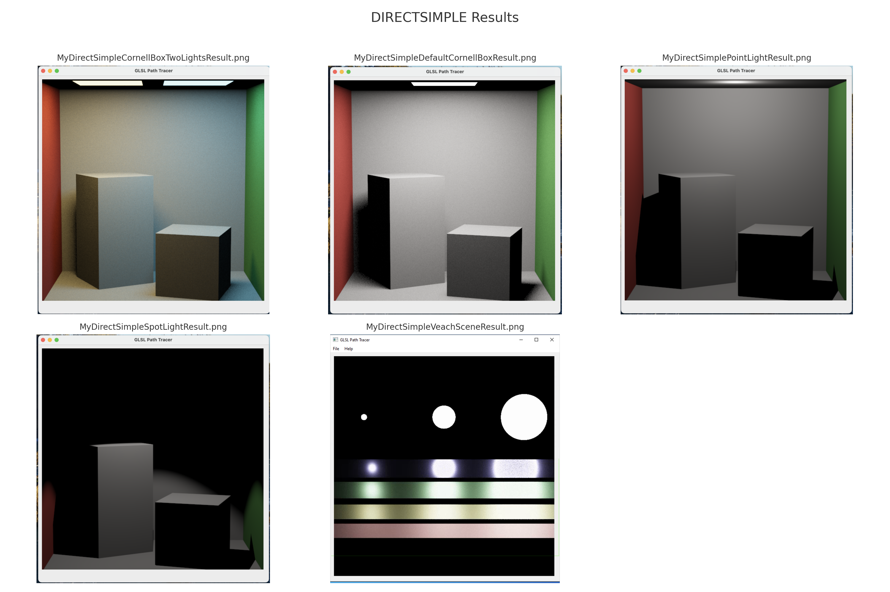
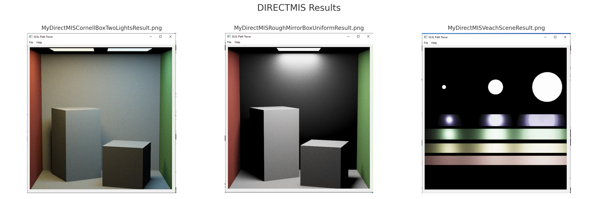

## Summary

This project implements a Monte Carlo path tracer using GLSL, QT, and C++, developed incrementally across five homework assignments for a university-level computer graphics course. It begins with foundational components such as warp functions and a naive diffuse integrator, followed by support for specular and transmissive BSDFs. Subsequent stages introduce direct lighting estimation using sampled light sources, and multiple importance sampling for improved variance reduction in complex scenes. The final integrator, `Li_Full`, combines direct and indirect illumination with environment lighting, enabling robust global illumination with support for microfacet materials and custom scenes. The resulting renderer is capable of producing photorealistic images with improved convergence behavior across diverse lighting conditions and materials.

## Motivation

Physically-based light transport around a camera view plays a central role in visual effects, games, and simulation. This project was motivated by a desire to understand the principles and challenges behind Monte Carlo light transport through hands-on implementation. By incrementally building a GLSL-based path tracer from low-level sampling functions to full global illumination with multiple importance sampling, this project provided a structured opportunity to explore how theoretical models such as the light transport equation are translated into interactive rendering systems.

Furthermore, programming directly in GLSL for the majority of this assignment offered insight into GPU-side constraints, optimizations, and OS differences critical for rendering workflows.

## Achievements

1. Implemented four integrators to visualize Monte Carlo light transport: `Li_Naive`, `Li_Direct`, `Li_DirectMIS`, and `Li_Full`, each progressively incorporating more accurate sampling strategies and lighting effects.
2. Verified cross-platform compatibility across macOS, Windows, and Linux through successful compilation and rendering on each system.
3. Demonstrated support for a wide range of BRDF materials—including dielectrics and microfacets—by accurately rendering scenes with diverse reflective and transmissive properties, such as glass and metal, using physically correct `Kd` and `Ks` parameters.
4. Validated correctness and flexibility using standard benchmarks including the Cornell Box and Veach scenes, as well as custom scenes with varying environment lighting and complex material setups.
5. Enabled support for arbitrary HDR environment maps by incorporating spherical environment sampling into the light integrator pipeline.
6. Added a GUI selector that allows users to switch between integration methods (`Naive`, `Direct`, `DirectMIS`, and `Full`) at runtime without restarting the application. This enhancement improves workflow efficiency and enables real-time visual comparison of integration results.

## Next Steps

- [ ] Understand and attempt to implement Russian Roulette termination: should improve performance by adaptively shortening low-contribution ray paths.

## Method

This project is structured around a modular GLSL path tracing pipeline. Core components include the main integrators in `glsl/pathtracer.frag.glsl/`, light sampling routines in `glsl/pathtracer.light.glsl/`, and BSDF evaluation and sampling in `glsl/pathtracer.bsdf.glsl/`. Scene data such as geometry, materials, and lights are loaded from JSON files at runtime.

### Integration Methods (`pathtracer.frag.glsl`)

- **`Li_Naive`**: A basic path tracing integrator that recursively samples BSDFs to simulate indirect illumination. It does not compute direct lighting explicitly and ignores emitted light unless encountered through perfect specular reflection.


- **`Li_Direct`**: Adds single-bounce direct lighting estimation by explicitly sampling light sources via `Sample_Li`, in addition to BSDF-based sampling. This version improves convergence in scenes with small or distant lights.

    

- **`Li_DirectMIS`**: Implements multiple importance sampling by combining BSDF sampling and light sampling. Each path is evaluated using both techniques, and their contributions are weighted using the power heuristic to reduce variance.

    

- **`Li_Full`**: Combines the global illumination of `Li_Naive` with the MIS-based direct lighting of `Li_DirectMIS`. Additionally, it incorporates environment light sampling for HDR maps and performs direct light evaluation at each intersection of diffuse or microfacet surfaces.

    

### Light Sampling (`pathtracer.light.glsl`)

The `Sample_Li` function is used in direct and MIS integrators to query scene lights. It supports:

- **Area Lights**: Sampled using surface projection and solid angle PDF conversion, with occlusion checks for visibility.

- **Point & Spot Lights**: Handled using delta distributions and evaluated using closed-form visibility and intensity falloff.

```cpp
// glsl/pathtracer.light.glsl/
vec3 DirectSamplePointLight(int idx, vec3 view_point, int num_lights, out vec3 wiW, out float pdf)
{
    PointLight light = pointLights[idx];

    wiW = normalize(light.pos - view_point);

    pdf = 1.f;

    Ray shadowRay = SpawnRay(view_point, normalize(light.pos - view_point));
    Intersection shadowIsect = sceneIntersect(shadowRay);

    float dist = distance(view_point, light.pos);
    if (shadowIsect.t <= dist) {
        return vec3(0.f);
    }

    return light.Le / (dist * dist) * float(num_lights);
}
```

- **Environment Lighting**: Sampled via cosine-weighted hemispherical directions and mapped to environment UVs; visibility checks ensure contributions only when the "sky" is visible.

PDF values are computed using `Pdf_Li` for both light- and BSDF-sampled directions, supporting MIS evaluation.

### BSDF Evaluation (`pathtracer.bsdf.glsl`)

BSDF sampling is used in all integrators to determine bounce directions. Material types supported include:

- **Diffuse** (Lambertian): Sampled with cosine-weighted hemispheres.

```cpp
// glsl/pathtracer.bsdf.glsl/
vec3 Sample_f_diffuse(vec3 albedo,
                      vec2 xi,
                      vec3 nor,
                      out vec3 wiW,
                      out float pdf,
                      out int sampledType)
{
    vec3 wi = squareToHemisphereCosine(xi);
    // Set wiW to a world-space ray direction since wo is in tangent space.
    mat3 worldMat = LocalToWorld(nor);
    wiW = worldMat * wi;

    pdf = squareToHemisphereCosinePDF(wi);  // tangent space pdf

    sampledType = DIFFUSE_REFL;

    return (albedo * INV_PI);
}
```

- **Specular** (Mirror): Samples the perfect reflection direction.

- **Dielectric** (Glass): Computes both reflection and refraction using Fresnel dielectric evaluation, with branching for total internal reflection.

- **Microfacet**: Evaluated in MIS and Full integrators using GGX distributions, though not sampled directly in this project.

Each `Sample_f` variant returns both a sampled direction and corresponding PDF, and contributions are scaled by the BSDF value and cosine of the incident angle, i.e. the Monte-Carlo equation.

### Accumulation and Display

Each frame accumulates path-traced radiance values using floating-point buffers in OpenGL. Colors are tone-mapped using a Reinhard operator and gamma corrected before display. Sampling is progressive and temporally averaged, converging over multiple frames.

```cpp
// glsl/noOp.frag.glsl/
vec4 reinhardOp(vec4 c)
{
    return c / (1.f + c);
}

vec4 gammaCorrection(vec4 c)
{
    return pow(c, vec4(1.f / 2.2f));
}
```

### Integration Method Switch within UI

A custom QT GUI element was implemented to allow runtime switching between integration methods. Internally, a uniform variable is updated to reflect the chosen integrator. This unique feature instantly streamlines testing and visual comparison between the integrator types.


