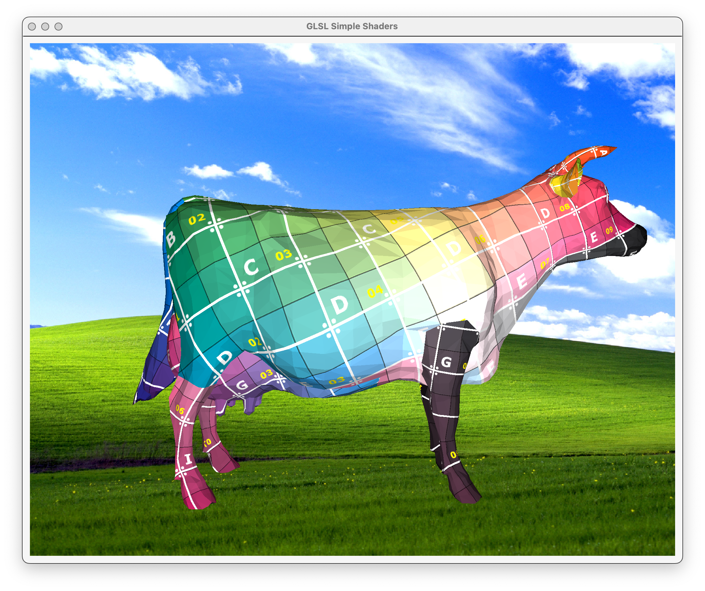
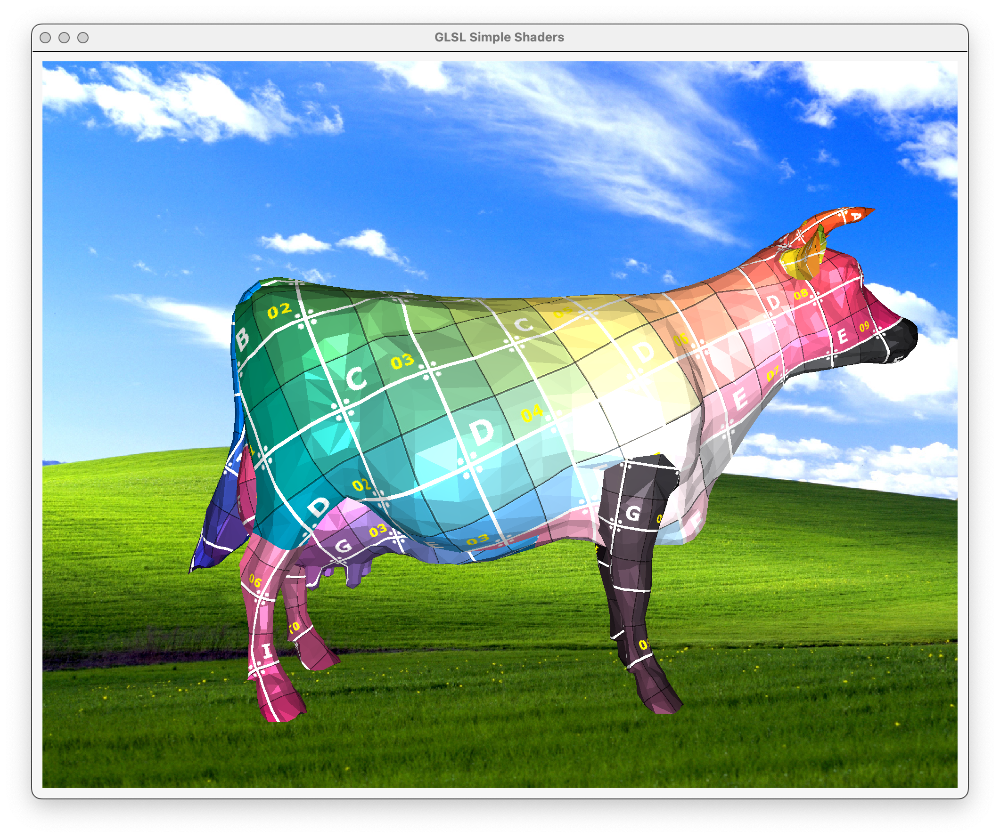
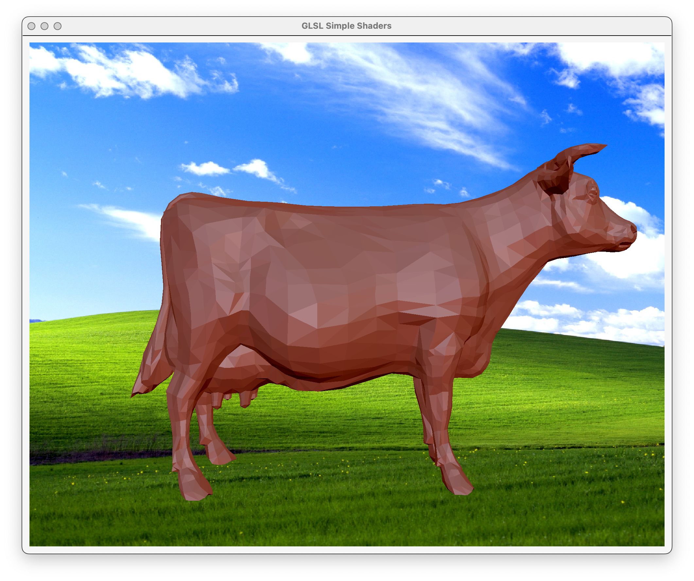
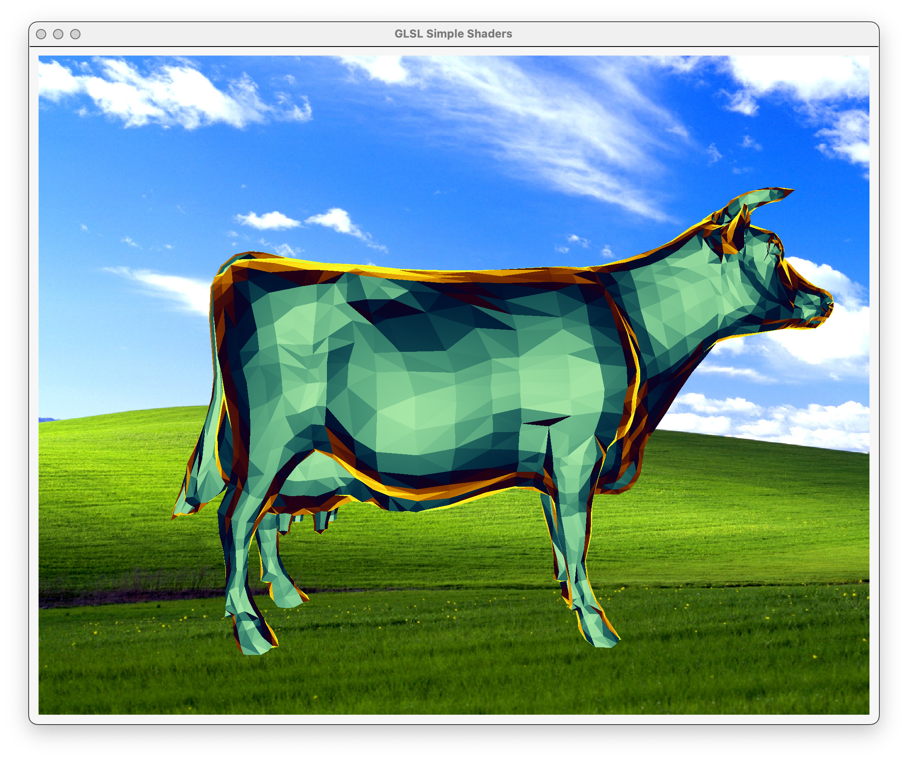
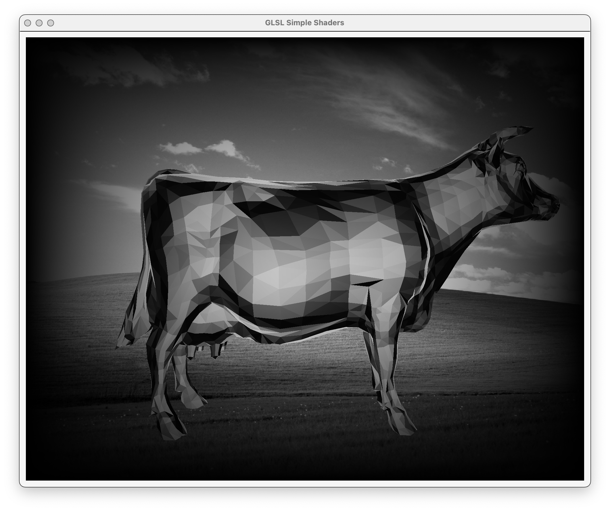
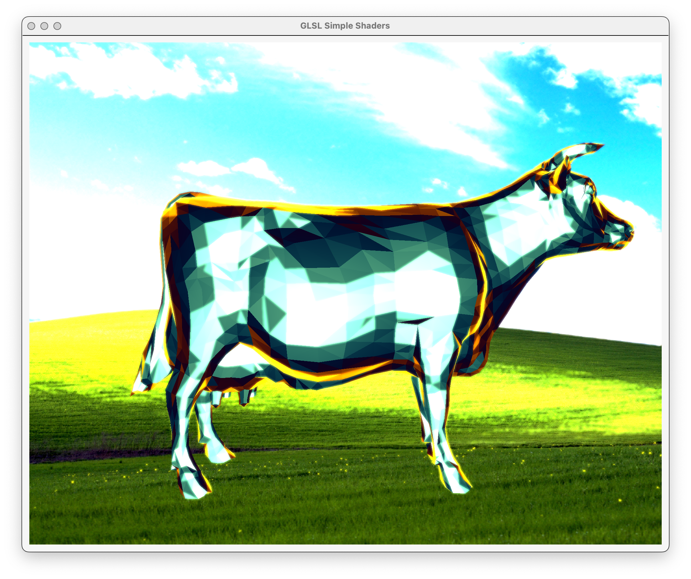

## Summary

This project implements a set of GLSL shaders to explore fundamental shading models and post-processing techniques. It includes surface shaders such as Blinn-Phong, toon shading, and normal visualization, as well as image-space effects like grayscale conversion, color tinting, screen-space distortion, and vignette. Each shader is built using modular GLSL functions that follow CG best practices and prioritize visual clarity.

## Motivation

Modern graphics applications rely on a wide range of shading and post-processing techniques to control visual style, clarity, and realism. This project was motivated by a desire to develop a practical understanding of how these effects are implemented at the shader level. By re-creating a focused set of surface and image-space effects from scratch, the project offers a hands-on opportunity to reinforce GLSL syntax, modular shader design, and the creative manipulation of framebuffer data within the OpenGL pipeline.

## Achievements

1. Implemented multiple real-time surface shaders, including Blinn-Phong, toon shading, and normal visualization.
2. Developed post-processing effects using full-screen fragment shaders, including grayscale, tint, distortion, and vignette.
3. Utilized core CG toolbox functions such as:

- **Dot products and vector normalization** for lighting calculations.
- **View-space normal transformation** for matcap projection.
- **Screen-space UV manipulation** for distortion and post-processing.
- **Kernel-based convolution** for blur and edge detection.
- **Noise functions and distance fields** for procedural texturing and warping.

## Next Steps

- [ ] Add support for user-adjustable shader parameters (e.g. vignette intensity, distortion scale) via GUI controls.

## Method

The project is organized around a two-stage rendering pipeline: a surface shader pass and a post-processing pass. All relevant shader code is available in the [project repository](https://github.com/mialana/glsl-simple-shaders) at `glslSimpleShaders/glsl/`.

### Surface Shader Stage

In the first pass, geometry is rendered with one of several user-selectable surface shaders:

- **Lambert**: Basic diffuse shading using the surface normal and light direction.

- **Blinn-Phong**: Adds specular highlights using a halfway vector.

- **Matcap**: Applies a stylized material capture (matcap) texture by mapping view-space normals directly to UV coordinates on a 2D matcap image. This technique simulates lighting and shading using a single texture lookup, making it lightweight and visually expressive. Users can choose from styles such as Red Clay, Chrome, and Outline.

- **Color Gradient**: Maps object height to a vertical color ramp.

- **Vertex Deformation**: Displaces vertex positions in the vertex shader based on time or procedural noise.

### Post-Processing Stage

After the surface pass, a full-screen quad is rendered using one of several post-process shaders. These shaders operate on a texture (`u_RenderedTexture`) containing the rendered scene and apply effects such as:

- **Greyscale**: Converts RGB to luminance.

- **Gaussian Blur**: Applies a separable blur kernel to smooth the image.

- **Sobel**: Detects edges using gradient convolution.

- **Bloom**: Bright-pass filter followed by blur and additive blending.

- **Worley Noise**: Generates a cellular noise pattern and uses it to apply a dynamic screen-space warp, resulting in a subtle animated translation of the scene.

### GUI Interaction

The application UI is implemented using Qt and provides real-time dropdown menus for 1. Surface shader, 2. Post-process shader, 3. Model (loaded OBJ file), and 4. Matcap texture variant (if applicable).
