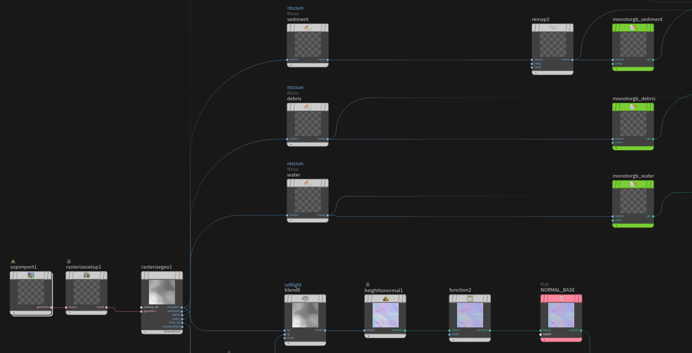
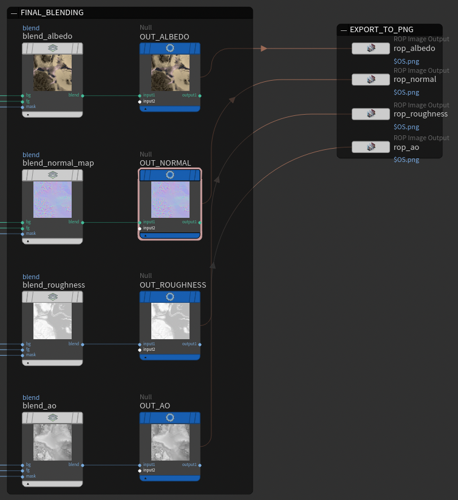
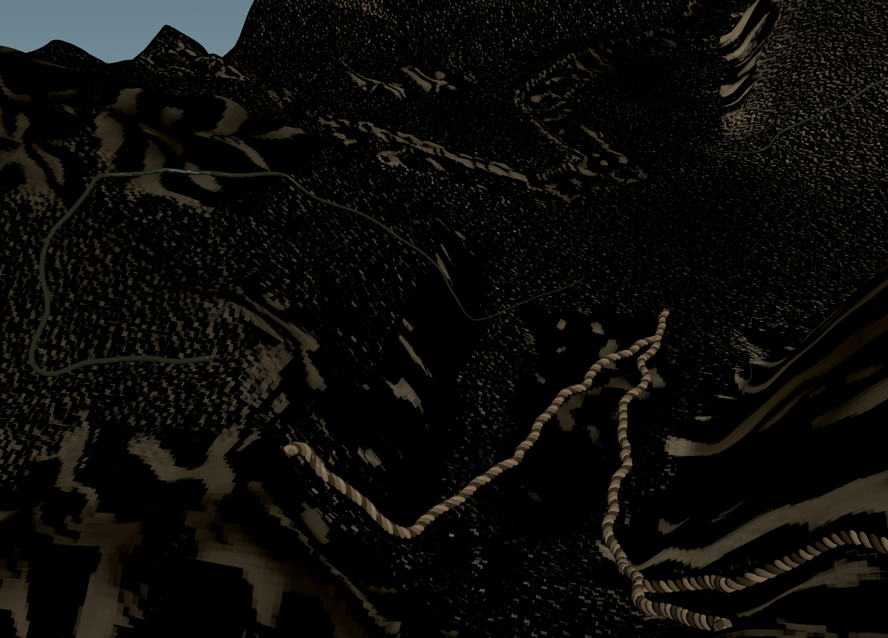
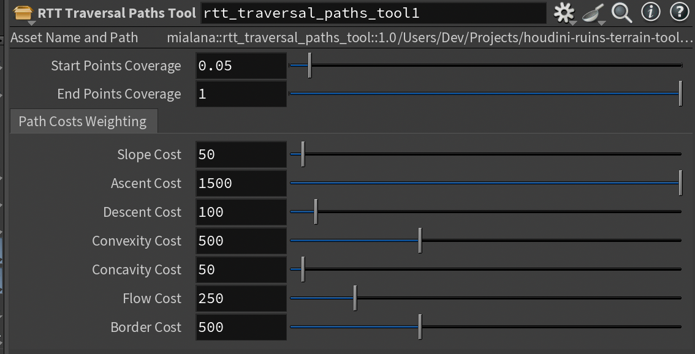
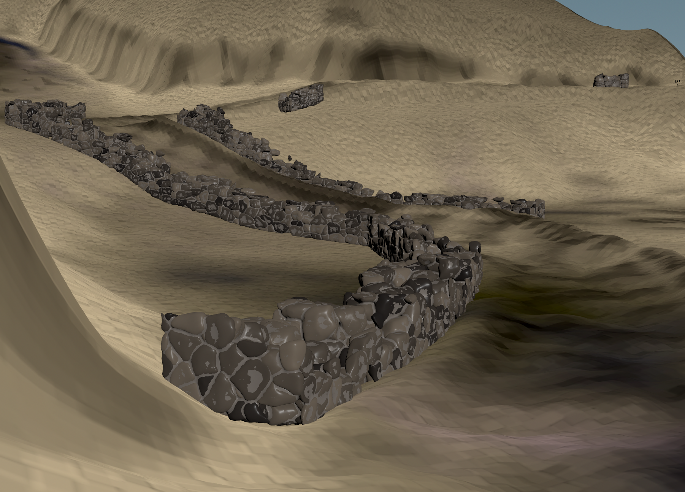
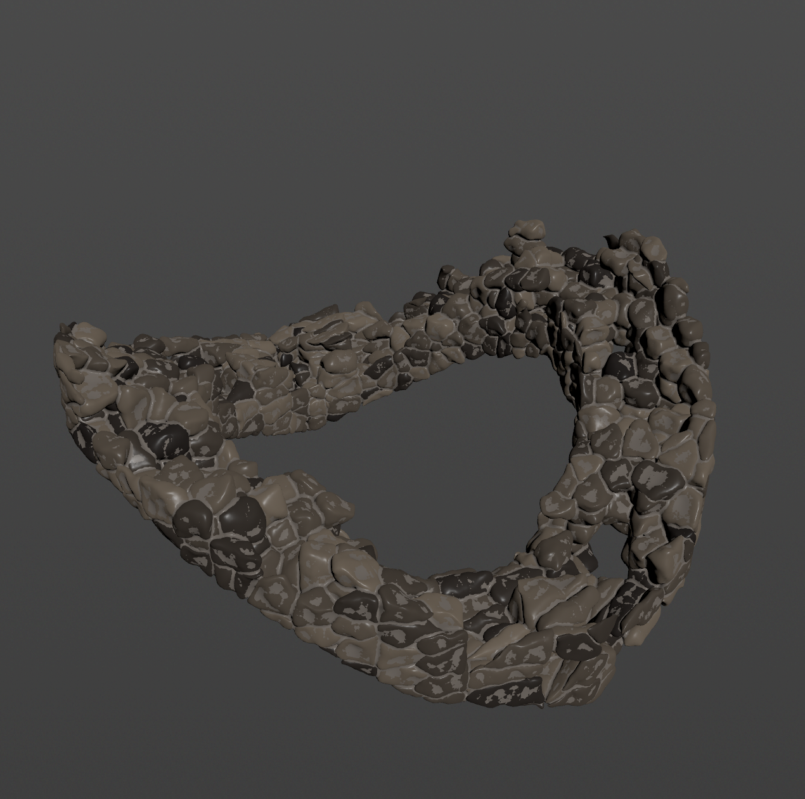
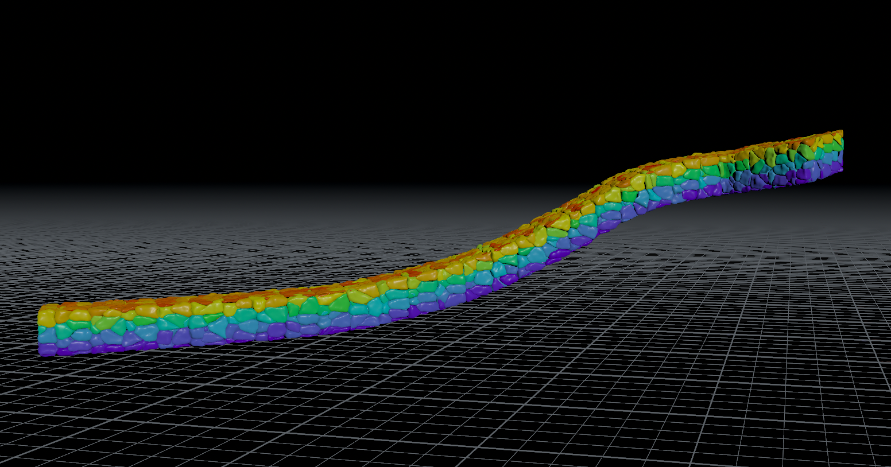
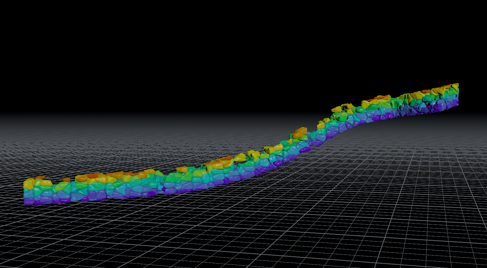

## Summary

This project presents Ruins Terrain Toolset, or RTT, a procedural toolset developed in SideFX Houdini for generating ruined terrains and detailed environmental assets suitable for real-time game engines, such as Unity or Unreal. Notably, all included geometry, tools, and interactions are procedurally constructed entirely within native Houdini without relying on external mega-scan libraries.

It features heightfield-based terrain geometry, Copernicus texturing, rigid-body dynamics (RBD) simulations/fracturing, dynamic shortest path calculations, and more.

## Motivation

Building the toolset entirely within Houdini emphasizes the completeness of Houdini’s native procedural systems for end-to-end 3D environment generation. By relying solely on Houdini’s geometry and material networks, the project demonstrates how complex scenes and assets can be built without external dependencies or traditional sculpting workflows. Just 100% procedural.

Furthermore, the system can support rapid prototyping for level design and environment lookdev in Unity and Unreal. It serves as a general baseline example for proceduralism in tech art pipelines, highlighting reusable patterns in Houdini node workflows and good practices for efficiency and speed.

## Achievements

1. **Main Terrain Generator**: A flexible heightfield-based terrain HDA designed for ruined and fragmented environments. Built using layered noise patterns, erosion simulations, and material masks generated with Copernicus.
    1. RTT Main Terrain
2. **Tools:** A set of reusable utilities for given a ruined appearance to 3D terrain environments.
    1. RTT Traversal Paths Tool
    2. RTT Layered Fracture Tool
    3. RTT Flooded Water Tool
    4. RTT Terrain Blockout Tool
3. **Assets**: A collection of static assets stylized for ruined terrain. Each asset is designed to support in-engine reuse and parameter tuning.
    1. RTT Decayed Rock Wall Asset
    2. RTT Fractured Column Asset
    3. RTT Terrain Rocks Asset
4. **Demonstrated Tool Interactions:** HDAs that demonstrate the ease-of-use and flexibility of the main terrain HDA and associated tools through physics simulations (Rigid Body Dynamics) and associated tool usage.
    1. Piled ruins geometry (RBD collision + scattering) on *Main Terrain*
    2. Traversing vines and ropes using *Traversal Paths Tools*

## Next Steps

- [ ] Copernicus textures and material networks for RTT rock wall, fractured column, and terrain rocks assets.
- [ ]  Refined Copernicus textures for RTT Flooded Water Tool geometry.

## Method

This project is my first large-scale Houdini project. The development process began with self-study through online tutorial series, evolving into building original networks as I became more comfortable with Houdini’s procedural workflow. Decisions were guided by the constraints of the Game Art Challenge, which required exclusive use of Houdini and Copernicus, encouraging a deeper understanding of native workflows.

### RTT Main Terrain

The terrain generator is built as a heightfield-based HDA that allows for sculpting, masking, and texturing using a fully procedural, modular approach.Artists can add or subtract geometry from the base terrain by projecting meshes into the heightfield using `Heightfield Project`. Once projected, various terrain-shaping nodes such as `Heightfield Noise`, `Heightfield Distort`, and `Heightfield Blur` are chained to control macro and micro surface features. A custom `Volume VOP` mask isolates bedrock-like regions, which are selectively lifted with `Heightfield Remap`. To finalize terrain realism, `HeightField Erode` simulates geological weathering.

In addition, the `Terrain_Path/` subnetwork allows artists to embed traversable paths into terrain. A custom spline input is projected and ray-transferred onto the terrain, then used to mask out a region via `Heightfield Mask by Object`, blurred for natural blending, and distorted with procedural noise using `Heightfield Noise`. The output is a distinct terrain layer isolating the carved path without manual geometry sculpting.

#### Terrain texturing Copernicus workflow

For texture generation, a dedicated COP network (`copnet_terrain`) procedurally produces all required outputs (albedo, roughness, normal, and ambient occlusion) using Houdini's Copernicus system. Geometry is rasterized using `SOP Import` and `Rasterize Geometry` nodes, extracting masked heightfield layers such as `elevation`, `sediment`, `debris`, and `water`. Each scalar map is converted to color using `MonoToRGB` and blended sequentially through layered `Blend` nodes to form the final `ALBEDO_BASE`. An additional stream handles `bedrock`-based textures with separate noise and color ramps.

Normals are generated via `HeightToNormal`, with `Function` nodes performing normalization. Roughness and AO maps are blended similarly using `Remap`, `Constant`, and `Blend` nodes. All outputs (`OUT_ALBEDO`, `OUT_ROUGHNESS`, `OUT_NORMAL`, and `OUT_AO`) are written to disk using `ROP Image` nodes, adhering to OCIO color space conversions (e.g., ACEScg or sRGB) and baked texture formats.

This pipeline allows fine-grained lookdev control per layer and requires no external texture assets—making it a fully native Houdini solution, suitable for real-time usage.

### RTT Traversal Paths Tool

The RTT Traversal Paths Tool generates a series of traversal curves across terrain geometry using an attribute-weighted shortest path algorithm.

#### Cost Calculation

At the heart of this tool is an `Attribute Wrangle` that computes edge traversal costs between points using a weighted sum of:

- **Slope**: Computed via the dot product between the surface normal and world up vector, penalizing steep inclines.
- **Ascent/Descent**: Further biasing based on vertical travel direction.
- **Convexity/Concavity**: Derived from a `Measure Curvature` node, allowing terrain shape to influence pathing.
- **Flow**: Optional factor from values calculated by the `Heightfield Flowfield` SOP node.
- **Border Proximity**: Penalizing proximity to the edge of the terrain geometry to avoid paths that compute the shortest path as simply lining the edges.

Each of these cost factors is exposed to artists as a parameter and can be fine-tuned via sliders.

#### Shortest Path Computation

The network uses the `Find Shortest Path` SOP node to connect each pair of scattered start and end points. This node is configured to operate on a fused point graph generated from a triangulated 2D projection of the terrain, ensuring spatial coherence. Building each start-end pair is handled via a `For-Each` block and `Sort` node.

#### Use Case: Flooded Water Geometry

A notable application of the traversal path system is the procedural generation of shallow, terrain-following flooded water geometry. These water channels are computed by biasing the underlying traversal algorithm toward concave regions, valleys, and depressions.

Once computed, the curves are projected onto the terrain using `HeightField Mask by Object` and `Heightfield Mask Blur`. A Houdini `HeightField Shallow Water` SOP node then simulates natural water spreading / pooling and flow-field dependent water velocity.

The resulting geometry is shaded using a customized material network defined in `matnet_flooded_water`. The shader is based on a `Principled Shader` setup with texture maps generated in a dedicated Copernicus network. These include:

- **Albedo Texture**: Simulating water coloration and clarity.
- **Roughness Map**: Modulating surface glossiness across pooled regions.
- **Opacity Map**: Allowing partial transparency with localized depth variation.

This use case demonstrates an efficient method for producing believable, stylized flooded water effects that follows terrain attributes without simulating full fluid dynamics.

#### Use Case: Ropes and Vines

The RTT Traversal Paths Tool also supports procedural generation of natural dressing geometry — for example ropes and vines that follow the contour of the terrain. By adjusting traversal parameters to balance slope avoidance with concavity affinity, the tool generates splines that simulate the natural draping or growth patterns of climbing materials.

### RTT Layered Fracture Tool

The _RTT Layered Fracture Tool_ is a mask-driven procedural fracturing system designed to generate varied and naturalistic damage on geometry surfaces in real-time. It uses a layered Voronoi-based approach where multiple fracture passes are spatially directed by noise-driven masks, giving users fine-grained control over fracture placement and intensity.

#### Technical Overview

The tool begins with an `Attribute Wrangle` node to compute a vertical mask using a normalized ramp over the geometry’s Y-position. This creates a basic fracture influence gradient across the height of the mesh. An `Attribute Noise` node then introduces flow-based noise to the mask to add complexity and natural variation.

The mask is converted into scatter points via `VDB From Polygons` and `Scatter` nodes. These points drive the first Voronoi fracture layer through `Voronoi Fracture`. A secondary fracture pass is generated similarly, with a separate scattering pass to create more fragmented sub-structures.

The tool then performs a series of boolean operations and primitive-level `Attribute Promote` and `Wrangle` operations to filter and selectively delete smaller or unwanted fragments based on the mask intensity and user-defined thresholds. The result is then passed through a cleanup and consolidation stage before being output.

This approach allows the user to art-direct fracture density and placement via intuitive mask controls while preserving interactive performance.

### Use Case: RTT Fractured Column Asset

The _RTT Fractured Column Asset_ demonstrates the use of the RTT Layered Fracture Tool in a contextually relevant application. The asset begins with a simple polygonal column form—tapered using a `Linear Taper` node and constructed with primitives like `Tube`, `Box`, and `Circle`—refined by operations such as `PolyBevel`, `Boolean Subtract`, and `Match Size` to form the base geometry.

Once the base structure is finalized, the asset is passed into the RTT Layered Fracture Tool. There, the vertical mask gradient isolates the upper portion of the column as a target zone. This produces more intense fragmentation at the top, fading toward the base. The final fractured result includes both inner and outer layers.

### RTT Terrain Blockout Tool

The RTT Terrain Blockout Tool is a curve-driven system designed to generate projection geometry for shaping large-scale terrain features. Rather than directly sculpting the heightfield, artists draw input curves that are procedurally converted into terrain-modifying volumes, which are then passed into the _RTT Main Terrain_ HDA for additive or subtractive projection.

Each instance of the tool accepts a single curve as input and supports four blockout modes via a switch interface:

1. **Closed Curve Blockouts**: Converts curve into an extruded, closed form used for carving plateaus or basins.

2. **Open Curve Ridge Forms**: Sweeps the input curve to create ridge or valley geometries.

3. **Peaks**: Scatters points throughout a curve's inner area to generate cone-shaped peak geometry. Useful for mountain ranges.

4. **Distorted Masses**: Produces extremely deformed primitives ideal for embedding singular large, rough mountains into terrain.

### RTT Rigid Body Collider Interactor

The **RTT Rigid Body Collider Interactor** is a simulation-ready tool designed to generate piled geometry formations through RBD simulation.

The tool begins by accepting user-provided geometry, which must include a `name` attribute to ensure proper RBD object separation during simulation. This input geometry is scattered within a **tapered bounding box**, which defines the spatial extent and general distribution profile of the pile.

Instances are assigned using `Copy to Points`, and randomized transformations are applied through `Attribute Randomize` to vary orientation, position, and scale. The result is fed into a `RBD Bullet Solver`, where terrain geometry acts as a collision surface. Key solver parameters—including friction, bounce, gravity, and constraint resolution—are exposed for artist control, allowing fine-tuning of the pile’s structure and spread.

Once a convincing formation is reached, the simulation is frozen using `Timeshift` to bake a specific frame, producing a static result that maintains the fidelity of physics-driven interaction.

Although it pairs naturally with assets like the `RTT Terrain Rocks`, the tool is flexible and designed to support any input geometry with a valid `name` attribute—enabling usage with wood debris, building fragments, etc. This makes it a flexible, general-purpose component to replace reliance on external assets such as Quixel Megascan geometry.

### RTT Decayed Rock Wall Asset

The RTT Decayed Rock Wall Asset is a terrain-conforming modular structure designed to procedurally align with any user-provided curve—including paths with sharp turns and elevation changes.

The asset begins with a `Curve` input, which is resampled and segmented to define the backbone of the wall. At each segment, aligned bounding geometry is instantiated using sweep-based techniques and custom up-vector calculations to maintain proper orientation even along curves with high Y-differentials or tight angular turns. This ensures continuity and spatial coherence of wall segments across complex topologies.

A decay mask is computed using a vertical (Y-axis) gradient to emulate natural erosion from top-down weathering. This mask drives probabilistic deletion of individual rock pieces.

### Conclusion and Significance

This toolset demonstrates how complex environmental elements—such as fractured geometry, terrain composition, and debris placement—can be proceduralized through technically modular design. By balancing flexibility with ease-of-use, it serves as a practical example of how procedural tools built within Houdini can streamline asset creation pipelines without compromising artistic control.
