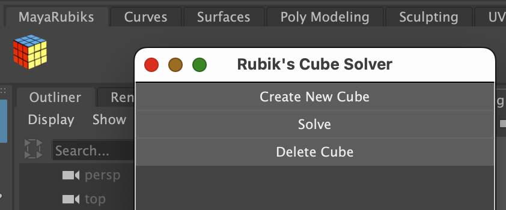

## Summary

Given the details of a scrambled Rubik's Cube, this Maya plug-in applies the [Kociemba algorithm](https://en.wikipedia.org/wiki/Optimal_solutions_for_the_Rubik%27s_Cube#Kociemba's_algorithm) and creates a full step-by-step animation of the cube's unique solution.

## Motivation

This project originated from a desire to explore Maya's internal graphics APIs and deepen my understanding of plug-in development within a production-grade 3D environment. Maya provides a rich platform for extending procedural workflows through Python, and this project leverages that extensibility.

By combining algorithmic problem solving with procedural animation, the plug-in serves as a proof of concept for using Maya as a tool for visualizing abstract computational logic. It also reflects my broader interest in creating tools that bring clarity to complex systems through real-time, visual representation—an approach increasingly valuable in both technical art and pipeline automation contexts.

## Achievements

1. **Live Viewport Integration and UI Handling**  
   Built a custom UI using `maya.cmds` with dynamic window management. The plug-in registers a custom Maya shelf and shelf button on startup and supports interactive feedback directly in the viewport.
2. **Encapsulated Plug-in Design with Clean DAG Lifecycle Management**  
   Packaged the plug-in for single-line activation via `Maya.env`. Registered a custom Maya command (`mayaRubiks`) with `create()` and `destroy()` methods that manage all DAG node creation and cleanup.

## Next Steps

- [ ] Better logic for individual cube transform matrices (use parent transforms and permanent groups).
- [ ] Support custom cube configurations: Allow users to input a specific cube state manually, enabling broader use cases beyond the current randomized cube configurations.
- [ ] Support export of rendered animation: Export cube animations as high-quality renders or explore integration of Maya viewport into other applications.

## Method

### Geometry Construction & Shading

The geometry of each individual cubelet is generated in `rubiks_cube.py` as Maya `polyCube` primitives. In `maya_rubiks_animation.py`, each cubelet is assigned a corresponding `aiStandardSurface` shader per face via Python commands. This involves programmatically creating shading nodes, setting color attributes, and connecting them to shape nodes.

```python
# MayaRubiks/scripts/maya_rubiks_animation.py
def create_shader(name, node_type="aiStandardSurface"):

material = cmds.shadingNode(node_type, name=name, asShader=True)

sg = cmds.sets(name="%sSG" % name, empty=True, renderable=True, noSurfaceShader=True)

cmds.connectAttr("%s.outColor" % material, "%s.surfaceShader" % sg)

return material, sg
```

Automating shader setup to bypass manual Maya Hypershade manipulation is vital to a Maya plug-in, maintaining the visual appearance and material usage across every generated instance.

---

### Scene State to Solver Communication

`rubiks_cube_solver.py` samples the current scene/cube state and translates it into a serialized string format. A subprocess call to muodov's `kociemba`
PyPi package returns the optimal solution, which is then parsed back into a list of discrete moves for `MayaRubiks` usage.

---

### Procedural Animation System

Each move is animated by creating a temporary group transform and rotating the group using quaternions. Animation steps are computed in `maya_rubiks_animation.py`.

---

### Tool Registration and UI Integration

The plug-in is initialized through `MayaRubiks.py`, which registers the `mayaRubiks` command using `OpenMayaMPx.MPxCommand`. This command sets up the persistent primitives of the scene (`polyCube`'s and `aiStandardSurface`'s ) and opens a custom UI window defined in `maya_rubiks_ui.py`. The UI provides 3 simple buttons to 1. `Create New Cube`, 2. `Solve`, and 3. `Delete Cube`. A custom shelf is included as part of the tool plug-in, and activation requires only appending the package path to `MAYA_MODULE_PATH` through `Maya.env` (detailed instructions in README and demo video).



This design enables the plug-in to remain self-contained and version-controlled, while allowing users to activate it with minimal environment configuration.
