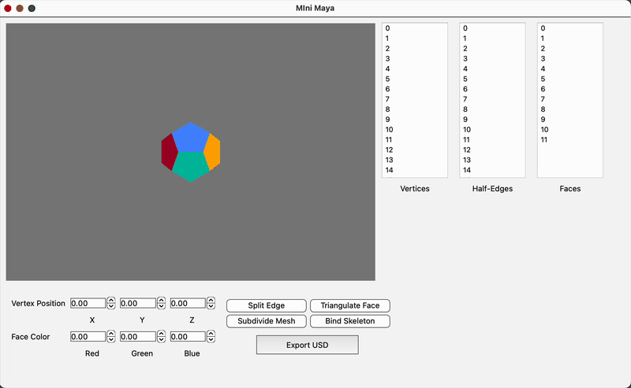
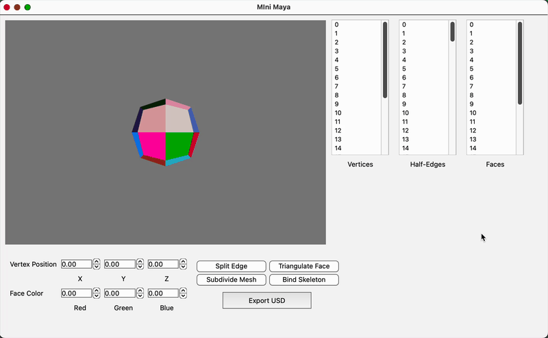
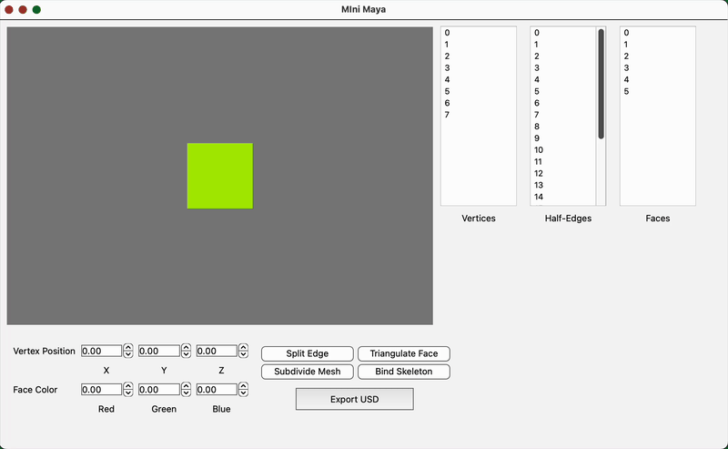

## Summary

Mini Maya is a lightweight 3D mesh-editing application developed in C++ and Qt, designed to replicate core features of commercial DCC software for educational purposes. The tool enables users to import OBJ files, interactively edit polygonal meshes, and apply Catmull-Clark subdivision using a half-edge data structure. It includes a real-time GLSL-powered OpenGL viewport for visual feedback, skeleton binding for basic rigging and transformations, and export capabilities to the OpenUSD format. This project reflects a practical understanding of mesh topology, graphics rendering, and GUI development.

## Motivation

Mini Maya was built to explore the practical implementation of a 3D modeling interface that supports direct manipulation of mesh topology and geometry. The project aims to provide a minimal but functional environment for understanding how features like subdivision, skeleton binding, and real-time feedback are orchestrated in desktop-based DCC tools. It serves as a sort-of testbed for experimenting with graphics programming concepts and custom data structures in a controlled setting.

## Achievements

1. **Interactive Half-Edge Editing Interface**: Developed a custom half-edge mesh structure with GUI tools for splitting edges, triangulating faces, adjusting vertex positions, and editing face colors.
2. **Catmull-Clark Subdivision with Real-Time Feedback**: Implemented recursive Catmull-Clark subdivision with GLSL-based viewport rendering to visualize smoothed geometry as users edit the mesh.
3. **Basic Skeleton Binding and Transformation**: Enabled users to import a joint hierarchy and bind it to the mesh for simple joint-driven transformations and deformation preview within the editor.
4. **Export to OpenUSD Format**: Integrated native USD C++ modules with a custom CMake setup to export edited mesh geometry as structured `.usd` files.

## Next Steps

- [ ] Extend USD export to include bound skeletons and joint transforms.

## Method

### Interactive Half-Edge Editing Interface

The core of the mesh editing system in Mini Maya is based on a custom **half-edge data structure**, implemented in `miniMaya/src/scene/halfedge.h` and `...halfedge.h`, which encodes connectivity between vertices, edges, and faces for efficient traversal and topological edits.

#### Half-Edge Mesh Data Structure

Each mesh consists of:

- `HalfEdge`: stores pointers to its `next`, `sym`, associated `face`, and `vertex`.
- `Face`: maintains a reference to one of its half-edges.
- `Vertex`: holds position data and one outgoing half-edge.

This structure allows O(1) traversal to adjacent elements, crucial for real-time editing.

#### Interactive Operations

Several operations are implemented with user-triggered GUI actions through the Qt interface:

- **Edge Splitting**: When the user selects an edge and clicks the “split” tool, the program computes the midpoint, inserts a new vertex, and updates adjacent half-edges to maintain consistency. This ensures that each face retains a valid loop and that symmetry is preserved.



- **Face Triangulation**: Selected faces can be triangulated by inserting a new central vertex and connecting it to each corner. This relies on iterating through the half-edges of a face, calculating triangle edges, and forming three new faces while updating adjacency.



- **Vertex Manipulation**: Vertex positions are adjusted using numeric sliders in the GUI, which update the selected vertex’s coordinates directly in the mesh data structure and refresh the OpenGL viewport accordingly.


- **Face Color Editing**: A color selection slider allows the user to assign a new RGB value to the selected face. The chosen color is stored in the face object and used in the fragment shader for display.

```cpp
// miniMaya/src/display.cpp
void FaceDisplay::create() {
    std::vector<GLuint> indices;       // Index buffer for drawing edges of the face
    std::vector<glm::vec4> positions;  // Vertex positions of the face corners
    std::vector<glm::vec4> colors;     // Per-vertex color (derived from face color)

    int fVertNum = 0;
    HalfEdge* he = displayedFace->m_hedge;

    // Traverse the boundary loop of the face via its half-edges
    do {
        // Get the position of the vertex this half-edge points to
        positions.push_back(glm::vec4(he->m_vert->m_pos, 1.0f));

        // Generate an inverted version of the face color for visual distinction
        colors.push_back(glm::vec4(
            1.0f - displayedFace->m_color.x,
            1.0f - displayedFace->m_color.y,
            1.0f - displayedFace->m_color.z,
            1.0f
        ));

        fVertNum++;       // Count vertices (used for indexing)
        he = he->next;    // Move to the next half-edge in the face loop
    } while (he != displayedFace->m_hedge);  // Loop until we return to the starting edge

    // Generate indices to draw line segments between consecutive vertices
    for (int i = 0; i < fVertNum; i++) {
        indices.push_back(i);                  // Current vertex
        indices.push_back((i + 1) % fVertNum); // Next vertex (looping back to start)
    }
}
```

#### Real-Time Feedback

All edits are immediately reflected in the GLSL-powered OpenGL viewport. A redraw is triggered on each modification, showing updated geometry or coloration.

### Catmull-Clark Subdivision with Real-Time Feedback

Catmull-Clark subdivision in this project is implemented as a recursive mesh refinement algorithm that operates directly on the half-edge structure. The goal is to generate a smoother version of a polygonal mesh by computing new vertex positions and reconstructing face connectivity accordingly.

#### Overview of the Subdivision Process

The algorithm follows the standard Catmull-Clark steps:

1. **Face Points**: For each face, compute the average of all its corner vertices. This becomes the new “face point.”
2. **Edge Points**: For each edge, compute the average of its two endpoint vertices and the two adjacent face points.
3. **Vertex Points**: Each original vertex is repositioned based on its adjacent face points, midpoints of surrounding edges, and its original position using the standard weighted formula.
4. **Topology Reconstruction**: Using the newly created points, the mesh is rebuilt with new quads. Each original face is subdivided into smaller faces by connecting the new face points, edge points, and vertex points.



Subdivision levels can be applied recursively, and each pass builds on the updated half-edge connectivity.

### Basic Skeleton Binding and Transformation

The skeleton system in Mini Maya enables users to import a hierarchical joint structure from JSON, interactively manipulate joints, and preview mesh deformation using linear blend skinning (LBS). This feature showcases a minimal but functional rigging system built into a custom C++/Qt graphics application.

#### Joint Hierarchy and Representation

Joints are parsed from the imported file and represented as a tree structure. Each joint stores:

- A local transformation (translation and rotation)
- A list of its children

For example:

```json
// jsons/two_joints.json
{
    "root": {
        "name": "Joint_1",
        "pos": [-1, 0, 0],
        "rot": [0, 1, 0, 0],
        "children": [
            {
                "name": "Joint_2",
                "pos": [2, 0, 0],
                "rot": [0, 1, 0, 0],
                "children": []
            }
        ]
    }
}
```

This structure is parsed recursively into a tree of `Joint` objects, each storing:

- Its local transform (position and quaternion)
- A pointer to its parent
- A list of child joints
- A global transformation matrix
- An inverse bind matrix (`bindMatrix`) computed once during binding

#### Binding and Vertex Weight Assignment

Once the skeleton is loaded, users can bind the mesh to the skeleton. Each vertex is manually assigned up to two influencing joints with associated weights through the GUI interface. The joint indices and weights are stored in custom per-vertex attributes.

The **bind matrix** of each joint captures the inverse of its global transform at the time of binding. These matrices are used during deformation to ensure consistent transformation from object to joint space and back.

```cpp
// miniMaya/src/scene/vertex.h
class Vertex : public QListWidgetItem
{
public:
    static int population;
    int id;

    glm::vec3 m_pos;
    HalfEdge* m_hedge;

    std::pair<Joint*, Joint*> influencers;
    glm::vec2 distances;
    glm::vec2 weights;
}
```

#### Linear Blend Skinning (LBS)

During rendering, each vertex position is transformed using linear blend skinning:

```glsl
// miniMaya/glsl/skeleton.glsl
uniform mat4 u_ViewProj;    // The matrix that defines the camera's transformation.
in vec4 vs_Pos;             // The array of vertex positions passed to the shader

out vec3 fs_Pos;

uniform mat4 u_BindMats[100];
uniform mat4 u_OverallTransforms[100];

uniform bool u_Binded;

in vec2 vs_Wts;
in ivec2 vs_Ids;

void main()
{
    vec4 modelposition
        = (u_Binded)
              ? (u_Model
                 * ((vs_Wts[0] * (u_OverallTransforms[vs_Ids[0]] * u_BindMats[vs_Ids[0]] * vs_Pos))
                    + (vs_Wts[1]
                       * (u_OverallTransforms[vs_Ids[1]] * u_BindMats[vs_Ids[1]] * vs_Pos))))
              : (u_Model * vs_Pos);

    fs_Pos = modelposition.xyz;

    gl_Position = u_ViewProj
                  * modelposition;  // used to render the final positions of the geometry's vertices
}
```

This deformation is updated in real time as joints are rotated or moved.

#### Joint Manipulation and Real-Time Feedback

- Users can select joints and adjust their position and rotation through GUI sliders.
- Rotation is applied via quaternions and updated recursively down the joint hierarchy.
- The OpenGL viewport immediately reflects joint transformations and mesh deformation.


### Export to OpenUSD Format

This feature enables exporting the current mesh in the editor to a valid `.usd` file using Pixar’s native USD C++ modules. Integration was handled through a custom CMake setup, allowing direct access to the USD API from within the application.

#### Export Logic using USD C++ modules

The exporter gathers mesh data from the internal half-edge structure, including:

- Vertex positions
- Face vertex counts and indices

These are written to a `UsdGeomMesh` like so:

```cpp
// miniMaya/src/mygl.cpp
void MyGL::slot_exportToUSD()
{
    pxr::UsdStageRefPtr stage = pxr::UsdStage::CreateNew(usda_file.toStdString());
    m_usdMesh = pxr::UsdGeomMesh::Define(stage, pxr::SdfPath("/MyRoot/MyMesh"));

    pxr::UsdAttribute face_vertex_counts = m_usdMesh.CreateFaceVertexCountsAttr();
    pxr::UsdAttribute face_vertex_indices = m_usdMesh.CreateFaceVertexIndicesAttr();
    pxr::UsdAttribute points = m_usdMesh.CreatePointsAttr();

    pxr::VtArray<int> face_vertex_counts_data;
    pxr::VtArray<int> face_vertex_indices_data;
    pxr::VtArray<pxr::GfVec3f> points_data;

    for (auto& face : m_meshCurrent.m_faces) {
        HalfEdge* firstHedge = face->m_hedge;
        HalfEdge* currHedge = firstHedge;
        int count = 0;

        do {  // Discover how many vertices are in this face
            count += 1;
            face_vertex_indices_data.push_back(currHedge->m_vert->id);

            currHedge = currHedge->next;
        } while (currHedge != firstHedge);
        face_vertex_counts_data.push_back(count);
    }

    // Iterate through mesh verts to read position data
    for (auto& vert : m_meshCurrent.m_verts) {
        glm::vec3 pos = vert->m_pos;
        points_data.push_back(pxr::GfVec3f(pos.x, pos.y, pos.z));
    }

    face_vertex_counts.Set(face_vertex_counts_data);
    face_vertex_indices.Set(face_vertex_indices_data);
    points.Set(points_data);

    stage->Save();
}
```

Export is triggered via the GUI and produces a structured `.usd` file that reflects the current geometry and color state of the mesh.

Notably, this export functionality was introduced in a later phase of development. Building directly on the C++ API helped maintain consistency with the application's internal data and modular design.
