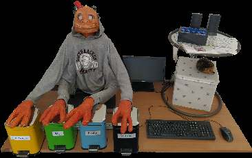
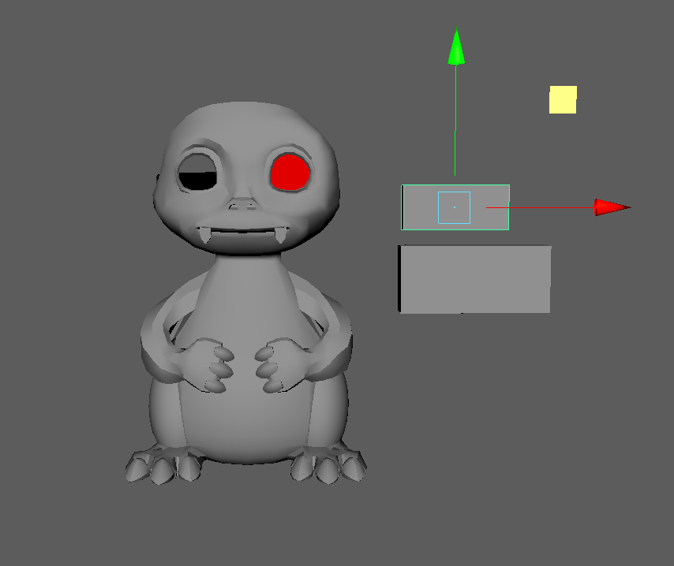
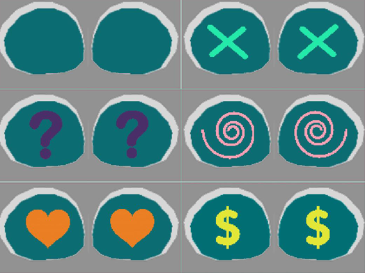
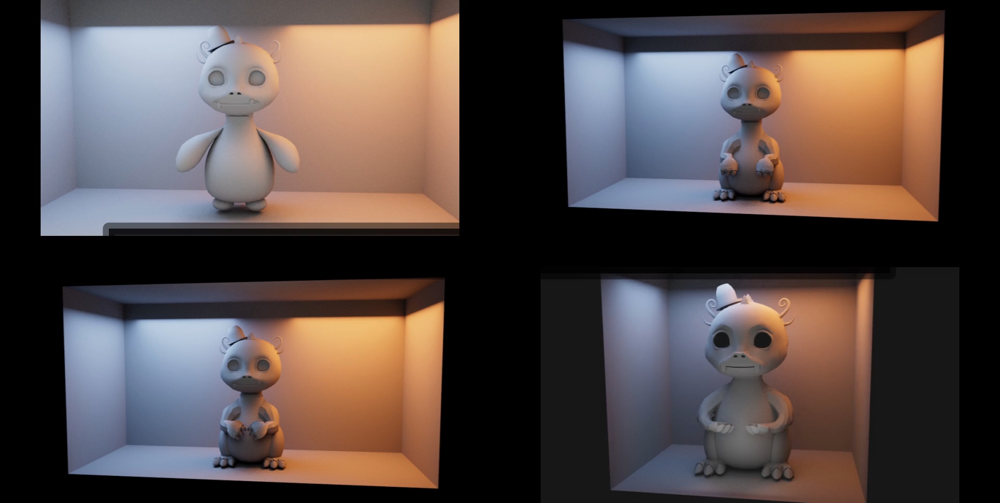
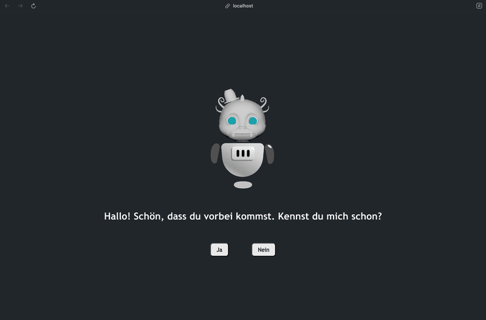

## Summary

MoBi-LE, or Monster Bin - Lite Edition, is a compact, 3D-printable second prototype of MoBi, an interactive robot originally developed to deliver various educational lessons in grade school classroom environments, such as proper waste management, etc. This project redesigns MoBi as a low-cost, distributable product for school systems with optimized hardware, software, and 3D design. Specifically, the new version 1. replaces a hand-built, papier-mâché frame with digital-modeled, physically-aware geometry and 2. transitions from a Linux laptop and button control pad setup to a Raspberry Pi-powered internal system with a touchscreen UI.

## Motivation

This project provides an opportunity to explore the role of 3D modeling and digital visualization in human-computer interaction, particularly in educational and interactive contexts.

Creating a complete 3D-printable redesign of an interactive robot requires careful consideration of physical assembly, part modularity, and visual coherence—all while working within the constraints of low-cost, single-material 3D-printing. Combined usage of Digital Content Creation (DCC) platforms such as Autodesk Maya with CAD engines such as Ultimaker Cura enables the translation of conceptual character design into precise, manufacturable geometry. More broadly, the project demonstrated how visual technologies can enhance the accessibility and effectiveness of interactive systems designed for non-technical audiences, especially children in classroom settings.

## Achievements

1. Designed a fully 3D-printable robot shell using Autodesk Maya, balancing character design with manufacturability and modular assembly.
2. Managed geometry restructuring and created hardware BOM (Bill of Materials) to support physical constraints (attachment points, internal mounting, cable routing, etc.) in coordination with software features.
3. Implemented a minimum-viable interactive UI to deliver on-screen prompts and input collection via touchscreen.
4. Presented at [HRI2024](https://humanrobotinteraction.org/2024/index.html) (annual international conference for Human-Robot Interaction research).

## Next Steps

- [ ] Refine the interactive UI MVP.
- [ ] Conduct usability testing with students and educators to assess engagement, effectiveness, and accessibility of the current design.

## Method

### 3D Model Design

The modeling process took visual and functional inspiration from the original first MoBi prototype.

The MoBi-LE robot body was modeled using Autodesk Maya, with emphasis on visual clarity, structural simplicity, and printability. The original character design was adapted into a modular digital form, split into multiple printable components such as the body, base, and arms. The design was constrained to fit within standard FDM printer dimensions (approx. 20×20×30 cm) to ensure accessibility and reproducibility.

Attachment points were embedded into the geometry to support later hardware mounting and enclosure. Care was taken to balance aesthetic and functional needs—ensuring the form was child-friendly, while keeping surfaces planar where feasible to reduce overhangs and support requirements. The final geometry was exported in `.stl` format and validated in Ultimaker Cura for slicing, support creation, and other printability processes.

### Software Interface Prototyping

A minimal Progressive Web App (PWA) built on ReactJS was prototyped to serve as an interactive UI displayed on the robot’s touchscreen. The app mimicked the original system's question/answer prompts and allowed basic tap interaction. The PWA served as a proof-of-concept for future interaction logic.

