## Summary

This project implements a streamlined pipeline for converting OpenUSD scenes into Neural Radiance Field (NeRF) representations using foundational computer graphics techniques. The system is divided into two components: a Qt-based GUI for scene inspection and multi-view data capture using a custom OpenGL-compatible Hydra render engine, and a Python-based CLI for training and evaluating a PyTorch NeRF model on the exported data.

By combining principles like hierarchical scene graph traversal, hemispherical camera sampling, and framebuffer-based image extraction with neural rendering methods such as positional encoding and volumetric ray integration, the pipeline simplifies the process of generating view-consistent neural representations from complex OpenUSD environments. It provides a ground-up bridge between traditional graphics tooling and modern neural rendering deep learning techniques — designed to be minimal, modular, and accessible to developers and researchers working directly with OpenUSD.

## Motivation

As neural rendering techniques such as NeRF become increasingly influential in computer graphics, there remains a lack of accessible tools that integrate these methods directly into OpenUSD. Furthermore, while industry-standard DCCs like Blender, Maya, and Houdini support USD workflows, there are few small-scale tools that make direct use of its native C++ modules. This project aims to bridge those gap by providing a minimal yet complete pipeline implementing basic neural rendering techniques using data directly acquired from OpenUSD scenes.

## Achievements

1. **OpenUSD Scene Traversal and Data Extraction (Qt and C++)**
    1. **Implemented a custom Hydra-based render engine** using OpenGL and framebuffer objects to support programmable, multi-view rendering of OpenUSD stages.
    2. **Developed a Qt-based GUI** that allows users to configure dome lights, sampling parameters, and rendering modes, with dynamic camera controls (orbit, pan, zoom) and visual feedback.
    3. **Automated multi-view image capture and camera parameter export**, storing outputs as PNG frames and JSON metadata compatible with neural rendering pipelines.
    4. **Created a modular Stage Manager class** to manage USD scene traversal, fixed and free camera pose generation, and synchronized rendering operations.
    5. **Packaged all C++ components into a portable CMake template**, integrating GLM and Boost to support scene parametrization and linear algebra operations.
2. **Neural Rendering Pipeline (Python CLI and NumPy / PyTorch)**
    1. **Built a Neural Radiance Field (NeRF) model from scratch** using PyTorch, implementing positional encoding, volumetric rendering, and a coarse-to-fine MLP architecture.
    2. **Processed input rays and scene samples** using camera intrinsics and pixel-ray generation techniques drawn from standard CG methods.
    3. **Designed a flexible Python CLI tool** using Click and Questionary to handle data preprocessing, model training, and evaluation with visualization options.
    4. **Generated novel view synthesis outputs**, including RGB images and depth maps, and evaluated render quality using metrics such as PSNR.
    5. **Conducted comparative tests and user feedback trials** to verify the alignment between NeRF outputs and original OpenUSD renders, and to assess ease of use.## Next Steps

## Next Steps

- [ ] Incorporating other neural rendering models such as 3D Gaussian Splatting.
- [ ] Add more GUI options such as 1. toggling standard sRGB color correction to OCIO and 2. switching camera view sampling from uniform to random.

## Method

### Part 1: USD Scene Traversal

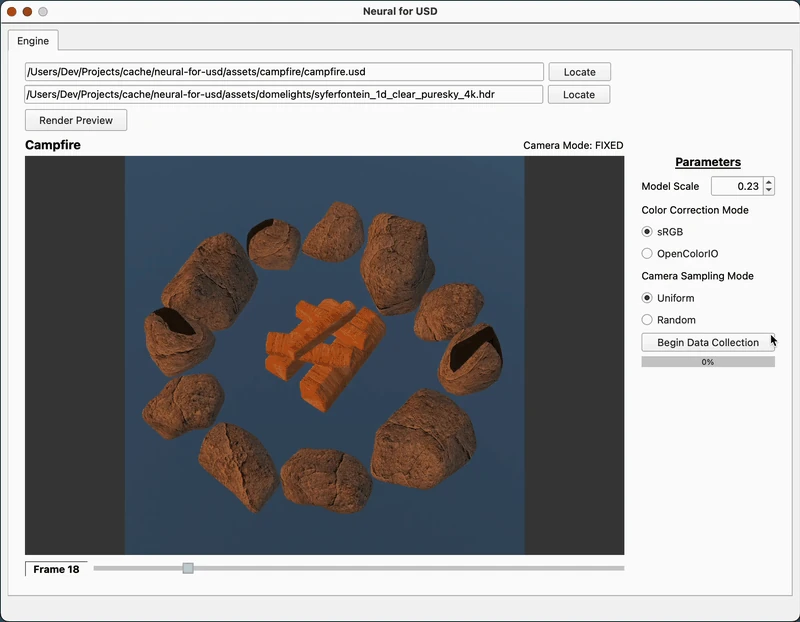

The Qt-based application is designed around two primary components: a **Stage Manager** and a **Render Engine**, both coordinated through a shared `OpenGLContext` (`QOpenGLWidget`). This architecture enables modular rendering and data collection from OpenUSD scenes.

#### Stage Manager

The Stage Manager handles all interactions with the OpenUSD scene. It owns the USD Stage object, controls both fixed and free camera behavior, and generates the necessary metadata for NeRF training. Key responsibilities include:

- **Loading and managing the USD stage** through `loadUsdStage()`, supporting both static and dynamic assets.
- **Camera frame generation** via `generateCameraFrames()`, which supports keyframe-based hemispherical sampling or manually configured free camera states.
- **Exporting data** using `exportDataJson()` to write camera intrinsics and extrinsics to structured JSON, alongside the rendered frames.

```cpp collapse={6-8}
// src/base/stagemanager.cpp
void StageManager::exportDataJson() const
{
	QJsonObject json;
	QJsonArray frames;

	for (const auto& frameMeta : m_allFrameMeta) {
		frames.append(frameMeta->toJson(m_outputDataJsonPath));
	}

	float aperture, focal;
	/* UsdGeomCamera */ m_geomCamera.GetHorizontalApertureAttr().Get(&aperture);
	m_geomCamera.GetFocalLengthAttr().Get(&focal);

	json["frames"] = frames;
	// compute FOV x using half-angle tangent trig rule
	json["camera_angle_x"] = 2.f * atanf(aperture / (2.f * focal));

	QFile file(m_outputDataJsonPath);
	if (file.open(QFile::WriteOnly)) {
		file.write(QJsonDocument(json).toJson());
	}
}
---
To match the JSON format of NeRF training data, OpenUSD C++ classes & methods provide all necessary values, after minor computation.
---
```

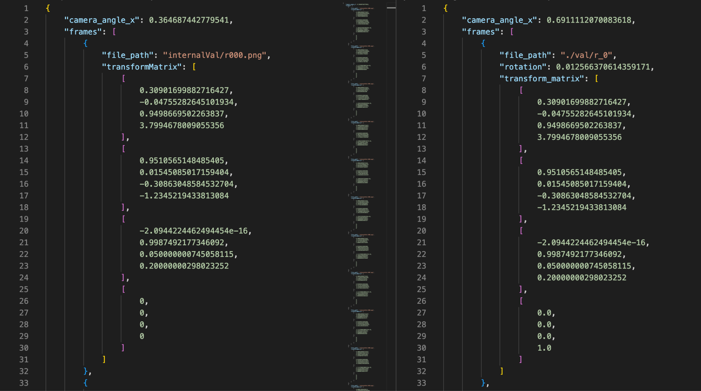

- **State reset and reinitialization** through `reset()`, ensuring the stage remains clean between different asset loads or capture runs.

Internally, the Stage Manager stores:

- A `UsdStage` reference for scene graph traversal
- A `UsdGeomCamera` for viewport alignment
- A free camera controller
- A pose generation module for determining view samples

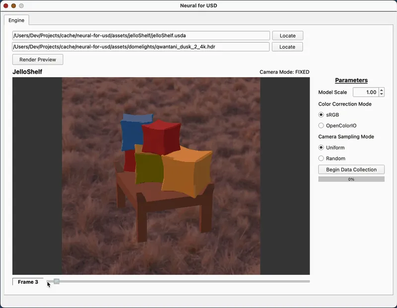

#### Render Engine

The Render Engine integrates with Hydra to provide OpenGL-based rendering of the current scene state. It directly queries framebuffers and AOVs to retrieve rendered color data and facilitates continuous rendering for multi-view frame capture. Core responsibilities include:

- **Render dispatch and viewport clearing** via `render()` and `clearRender()`, respectively.
- **Triggering recording cycles** through `record()`, which iterates over camera poses and requests the corresponding render output.
- **Frame resizing** with `resize()` to dynamically adjust to viewport changes.
- **Scene change tracking** using `isDirty()` to avoid redundant re-renders.

It also holds references to:

- The Hydra scene delegate
- Current rendering parameters
- A shared `isDirty` state flag for UI-refresh synchronization

```cpp collapse={5-19}
// src/base/renderengine.cpp

void RenderEngine::record(StageManager* manager)
{
	HgiTextureHandle textureHandle = m_imagingEngine.GetAovTexture(HdAovTokens->color);

	HioImage::StorageSpec storage;
	storage.flipped = true;

	size_t size = 0;
	HdStTextureUtils::AlignedBuffer<uint8_t> mappedColorTextureBuffer;

	// set buffer property values
	storage.width = textureHandle->GetDescriptor().dimensions[0];
	storage.height = textureHandle->GetDescriptor().dimensions[1];
	storage.format = HdxGetHioFormat(textureHandle->GetDescriptor().format);

	// where `Hgi` stands for "Hydra Graphics Interface"
	mappedColorTextureBuffer = HdStTextureUtils::HgiTextureReadback(m_imagingEngine.GetHgi(), textureHandle, &size);
	storage.data = mappedColorTextureBuffer.get();

	int frame = manager->getCurrentFrame();
	QString filename = manager->getOutputImagePath(frame);

	// where `Hio` stands for "Hydra Input/Output"
	const HioImageSharedPtr image = HioImage::OpenForWriting(filename.toStdString());
	const bool writeSuccess = image && image->Write(storage);
}
---
After mapping the imaging engine's color aov to a storage buffer, you can write out to standard PNG format.
---
```

Together, these components create a tightly coupled yet extensible rendering loop that supports user-driven data collection for downstream neural rendering. The entire system is built with modular C++ and configured through CMake, enabling cross-platform compilation and integration into broader pipelines.

### Part 2: Neural Rendering Pipeline

After extracting multi-view images and camera parameters using the Qt GUI, the second phase of the pipeline prepares the data and trains a Neural Radiance Field (NeRF) model implemented in PyTorch. The system is modular and interactive, with all functionality accessible through a structured command-line interface (CLI).

#### Input and Sampling Strategy

At the core of NeRF is a learnable function $f_{\theta}$ that represents the scene as a continuous volumetric field.
This function defines how any point in 3D space appears when viewed from a particular direction.

$$
\begin{align}
f_\theta : (\mathbf{x}, \mathbf{d}) &\mapsto (\sigma, \mathbf{c})
\end{align}
$$

Here, $f_\theta$ maps a 3D point $\mathbf{x}$ along a camera ray and the corresponding viewing direction $\mathbf{d}$ to a volume density $\sigma$, which encodes scene geometry, and an RGB color $c$, which encodes appearance.

Rays are generated per-image by the projection of pixels through the pinhole camera model. For each pixel, a ray origin and direction are computed using the camera intrinsics and extrinsics. Along each ray, multiple sample points are drawn between the near and far depth bounds.

At a resolution of 100×100 pixels with 64 samples per ray, training on 106 images results in $100 \times 100 \times 64 \times 106 = 67{,}840{,}000$ 3D point samples per batch.

```python collapse={8-18}
# src/nerf/nerf.py
def get_rays(
	height: int, width: int, focal_length: float, c2w: torch.Tensor
) -> Tuple[torch.Tensor, torch.Tensor]:

	# Create two tensors that correspond with x & y values of pixels
	# i is a (width, height) grid where each row has same x-value
	# j is a (width, height) grid where each column as same y-value
	i, j = torch.meshgrid(
		torch.arange(width, dtype=torch.float32).to(c2w),
		torch.arange(height, dtype=torch.float32).to(c2w),
		indexing="ij",
	)

	# Transpose to swap dimensions. Industry-standard, as images are inherently row-major (height, width).
	i, j = i.transpose(-1, -2), j.transpose(-1, -2)

	# Convert ray directions to camera-space
	# For pinhole camera model, map to [(-1, -1), (1, 1)] and then scale by focal length
	directions = torch.stack(
		[
		(i - width * 0.5) / focal_length, # x: (i - width/2) / focal
		-(j - height * 0.5) / focal_length, # y: -(j - height/2) / focal
		-torch.ones_like(i), # z: -1 (-1 is camera's forward)
		],
		dim=-1,
	)

	# Use "camera-to-world" matrix to convert ray directions to world coords
	rays_d = torch.sum(directions[..., None, :] * c2w[:3, :3], dim=-1)

	# Ray origin is uniform, extracted from the last column of "camera-to-world" matrix
	rays_o = c2w[:3, -1].expand(rays_d.shape)

	return rays_o, rays_d

---
Applies the pinhole camera model to find the origin (camera position) and direction of rays (through each pixel).
---
```

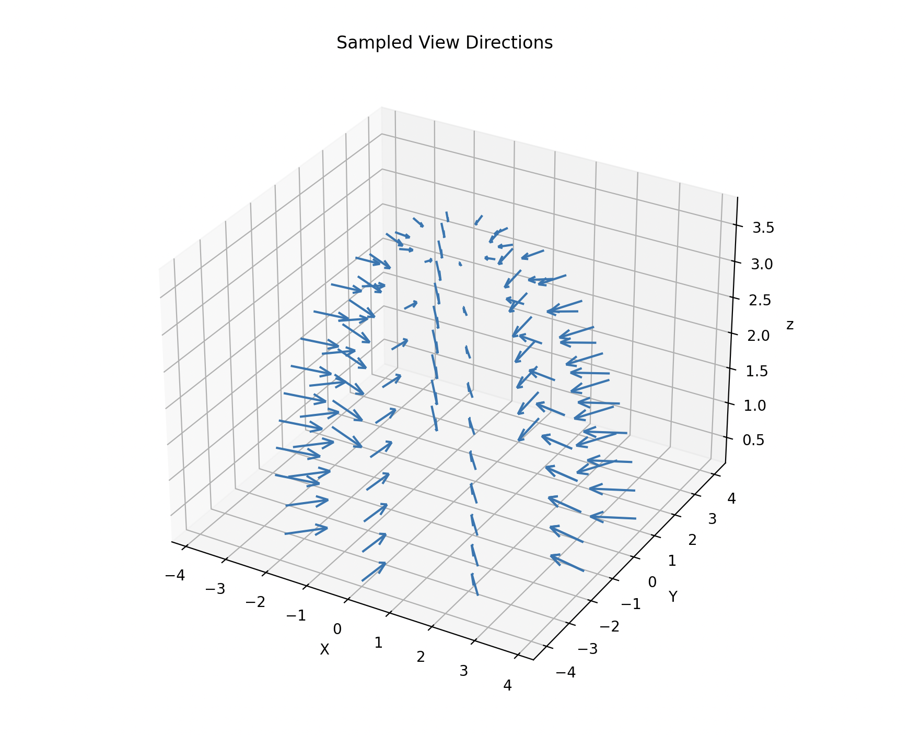
_A diagram of camera positions and orientations, which follow cosine-sampling in the upper hemisphere._

#### Positional Encoding

A standard multilayer perceptron (MLP) is biased toward learning low-frequency, smooth functions. However, Radiance Fields should be able to represent sharp geometric features. To address this, NeRF applies a positional encoding to the input coordinates before passing them to the network.

This encoding is applied to each scalar component of these vectors. So let $p$ denote a scalar input component, where:

$$
p \in \{x, y, z, d_x, d_y, d_z\}
$$

The encoding uses a fixed set of frequency bands $\{\omega_k\}$, chosen as powers of two in NeRF:

$$
\omega_k = 2^k \pi \quad \text{for} \quad k = 0, 1, \dots, L-1
$$

where $L$ is an empirically-chosen parameter. Larger values of L increase frequency, so typically in NeRF $L = 10$ for spatial positions and $L = 4$ for viewing directions, as position (which corresponds to scene geometry) requires more higher-frequency variation than direction.

Then, for each scalar input $p$, the positional encoding will be computed as:

$$
\gamma(p)
=
\left[
\sin(\omega_0 p), \cos(\omega_0 p),
\sin(\omega_1 p), \cos(\omega_1 p),
\dots,
\sin(\omega_{L-1} p), \cos(\omega_{L-1} p)
\right]
$$

So for position vector $\mathbf{x}$, the encoding will be:

$$
\gamma(\mathbf{x})
=
[
\gamma(x),
\gamma(y),
\gamma(z)
]
$$

And similar for viewing direction vector $\mathbf{d}$.

These encoded vectors form the actual inputs to the MLP, effectively representing each input component as sinusoidal basis functions rather than raw $\{x, y, z\}$ and $\{d_x, d_y, d_z\}$ values.

#### MLP Model Architecture

In practice, NeRF parameterizes $f_{\theta}$ using a deep multilayer perceptron (MLP). The MLP acts as a continuous function approximator, allowing the scene to be queried at arbitrary spatial locations and view directions without discretizing space.

The MLP architecture is designed to reflect the structure of the mapping defined by $f_{\theta}$:

- **8 hidden (intermediate) layers**, each with 256 channels and ReLU (Rectified Linear Unit) activations, provide sufficient expressive capacity to model complex geometry and appearance.
- **A residual (skip) connection** after the 4th layer helps preserve low-frequency spatial information while still enabling deeper layers.
- **Separate output heads** are used for RGB color and volume density ($\sigma$).
    - Density depends only on spatial position $\mathbf{x}$
    - Color depends on both position $\mathbf{x}$ and viewing direction $\mathbf{d}$.
    - Accordingly, density is predicted from the base network, while color is predicted from a branch that incorporates view-direction information.

```python collapse={2-4}
# src/nerf/nerf.py
class MLP(nn.Module):
	"""
	Multilayer Perceptron module.
	"""

	def __init__(
		self,
		d_input: int = 3, # `d_` prefix commonly used for dimensions
		n_layers: int = 8,
		d_filter: int = 256, # dimension of hidden layers
		skip: Tuple[int] = (4,),
		d_viewdirs: Optional[int] = None, # do not set for view-independency, i.e. predicted color will depend only on position
	):
---
The MLP class specifies its dimensions, number of layers, dimension of layers, skip layers if it has any, and dimensions of view directions.
---
```

#### Volumetric Rendering

NeRF renders images by querying the scene function $f_{\theta}$ along camera rays and compositing the resulting predictions using volumetric rendering. This process proceeds in two stages: a coarse pass to locate relevant regions along each ray, followed by a fine pass to refine the rendering.

##### Coarse and Fine MLP Evaluation

For each camera ray, a set of sample points is first drawn uniformly along the ray. These points are evaluated by a coarse MLP, which predicts volume density $\sigma$ and emitted color $c$ at each sample location. The predicted densities are used to compute per-sample weights, indicating how much each region along the ray contributes to the final image.

These weights define a probability density function (_PDF_) along the ray, which is then used for importance sampling. A second set of samples is drawn from this PDF using inverse transform sampling, concentrating samples in regions of high density. These new samples are evaluated by a fine MLP, which predicts the same physical quantities -- density and color -- but at more informative locations.

The coarse and fine MLPs therefore represent the same underlying scene function, evaluated at different sets of sample points, with the coarse pass guiding where the fine pass should sample more densely.

##### Final Volumetric Compositing

The raw outputs of the MLP—density and color predictions at sampled points—are converted into final renderings using the volume rendering equation. For each ray, this produces:

- **an RGB map**, obtained by accumulating color contributions along the ray,
- **a depth map**, computed as the expected distance along the ray,
- **an opacity map**, representing the accumulated opacity (one minus transmittance),
- **and sample weights**, which quantify each sample’s contribution.

The final rendered outputs are computed using the predictions from the fine pass, while the coarse pass serves to guide sampling during training.

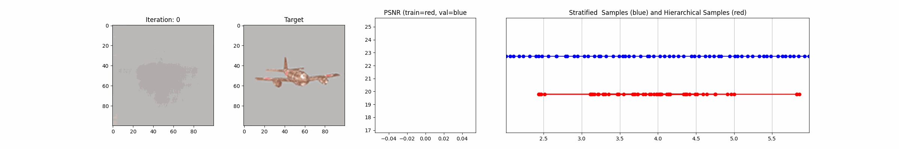
_NeRF training over time, illustrating 1. improving render quality, 2. increasing PSNR, and 3. the balance of uniform stratified sampling (via the coarse MLP pass) to focused hierarchical sampling (fine pass) along rays._

#### Python CLI and Workflow

The CLI, implemented using `Click` and `Questionary` PyPI packages, walks users through each stage of the pipeline.

##### Process NeRF Input Data

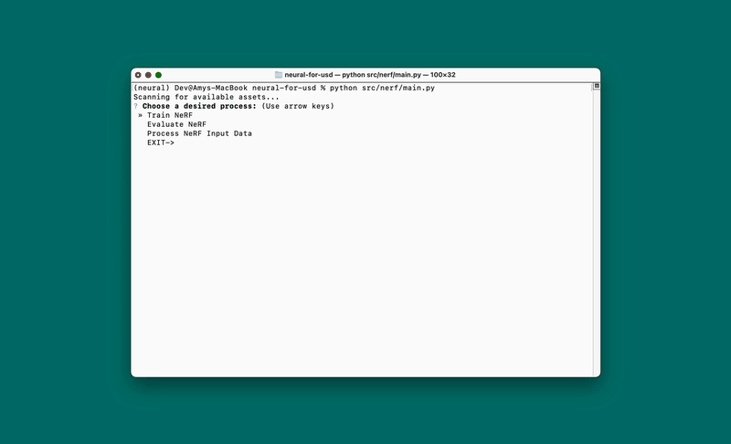

##### Train NeRF

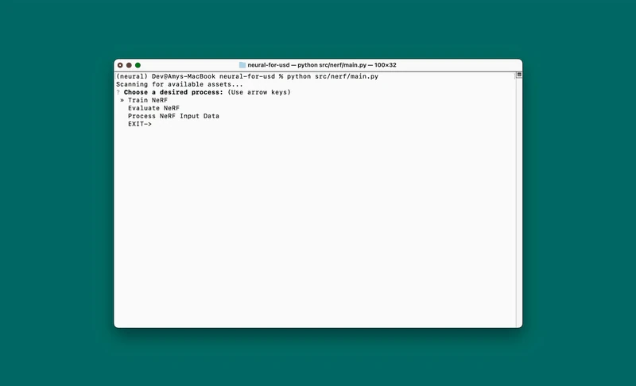

##### Evaluate NeRF

Choose from the following options:

- Reproduce a known input view

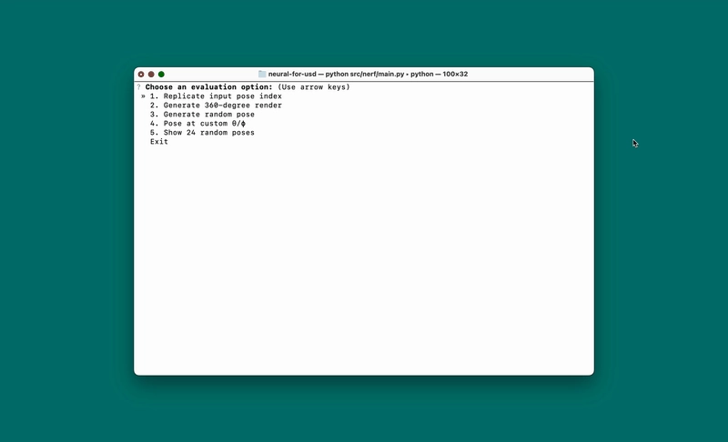

- Generate a 360° orbit animation

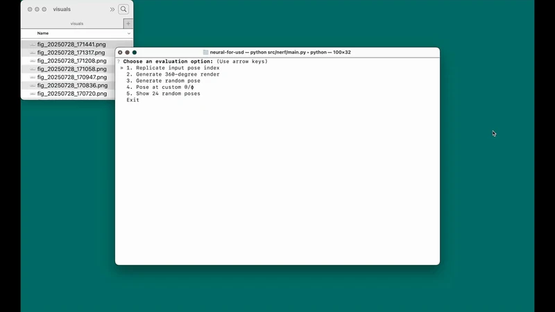

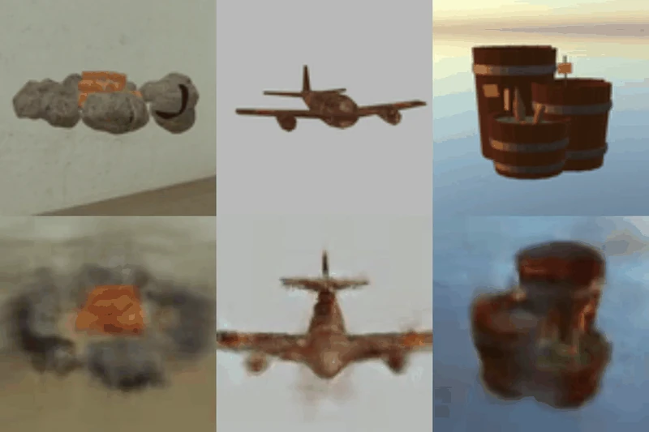

- Randomized novel views

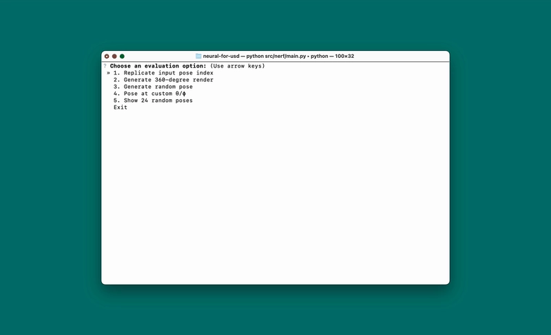

- Specify a custom $\theta$ or $\phi$ camera angle

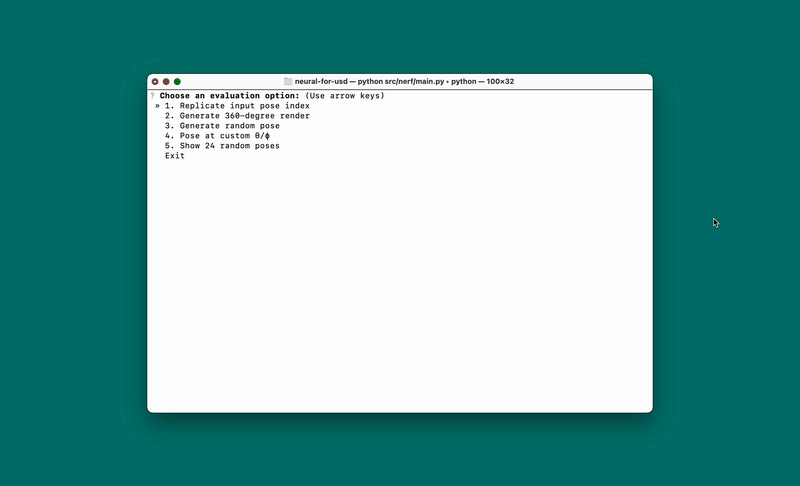

- Visualize 24 random test poses

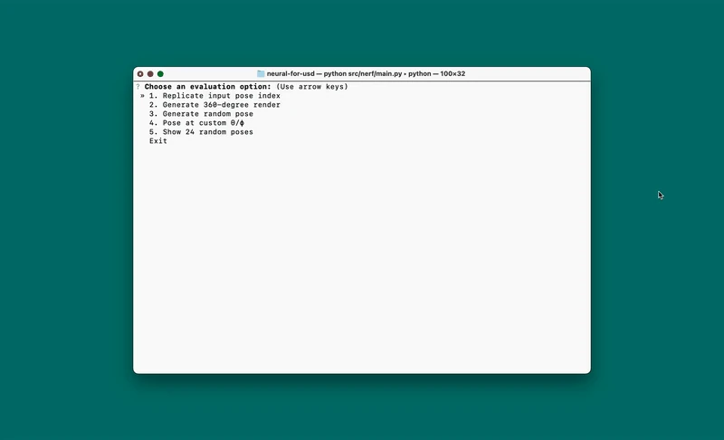

This modular NeRF pipeline offers a complete experience from structured USD scene traversal to novel view synthesis, and is designed for accessibility, reproducibility, and experimentation.
