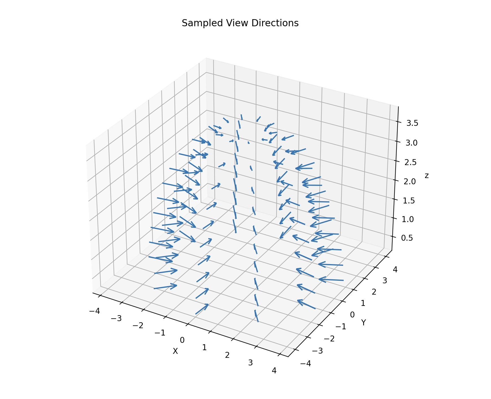

## Summary

This project implements a streamlined pipeline for converting OpenUSD scenes into Neural Radiance Field (NeRF) representations using foundational computer graphics techniques. The system is divided into two components: a Qt-based GUI for scene inspection and multi-view data capture using a custom OpenGL-compatible Hydra render engine, and a Python-based CLI for training and evaluating a PyTorch NeRF model on the exported data.

By combining principles like hierarchical scene graph traversal, hemispherical camera sampling, and framebuffer-based image extraction with neural rendering methods such as positional encoding and volumetric ray integration, the pipeline simplifies the process of generating view-consistent neural representations from complex OpenUSD environments. It provides a ground-up bridge between traditional graphics tooling and modern neural rendering deep learning techniques — designed to be minimal, modular, and accessible to developers and researchers working directly with OpenUSD.

## Motivation

As neural rendering techniques such as NeRF become increasingly influential in computer graphics, there remains a lack of accessible tools that integrate these methods directly into OpenUSD. Furthermore, while industry-standard DCCs like Blender, Maya, and Houdini support USD workflows, there are few small-scale tools that make direct use of its native C++ modules. This project aims to bridge those gap by providing a minimal yet complete pipeline implementing basic neural rendering techniques using data directly acquired from OpenUSD scenes.

## Achievements

1. **OpenUSD Scene Traversal and Data Extraction (Qt and C++)**
    1. **Implemented a custom Hydra-based render engine** using OpenGL and framebuffer objects to support programmable, multi-view rendering of OpenUSD stages.
    2. **Developed a Qt-based GUI** that allows users to configure dome lights, sampling parameters, and rendering modes, with dynamic camera controls (orbit, pan, zoom) and visual feedback.
    3. **Automated multi-view image capture and camera parameter export**, storing outputs as PNG frames and JSON metadata compatible with neural rendering pipelines.
    4. **Created a modular Stage Manager class** to manage USD scene traversal, fixed and free camera pose generation, and synchronized rendering operations.
    5. **Packaged all C++ components into a portable CMake template**, integrating GLM and Boost to support scene parametrization and linear algebra operations.
2. **Neural Rendering Pipeline (Python CLI and NumPy / PyTorch)**
    1. **Built a Neural Radiance Field (NeRF) model from scratch** using PyTorch, implementing positional encoding, volumetric rendering, and a coarse-to-fine MLP architecture.
    2. **Processed input rays and scene samples** using camera intrinsics and pixel-ray generation techniques drawn from standard CG methods.
    3. **Designed a flexible Python CLI tool** using Click and Questionary to handle data preprocessing, model training, and evaluation with visualization options.
    4. **Generated novel view synthesis outputs**, including RGB images and depth maps, and evaluated render quality using metrics such as PSNR.
    5. **Conducted comparative tests and user feedback trials** to verify the alignment between NeRF outputs and original OpenUSD renders, and to assess ease of use.## Next Steps

## Next Steps

- [ ] Incorporating other neural rendering models such as 3D Gaussian Splatting.
- [ ] Add more GUI options such as 1. toggling standard sRGB color correction to OCIO and 2. switching camera view sampling from uniform to random.

## Method

### Part 1: USD Scene Traversal


The Qt-based application is designed around two primary components: a **Stage Manager** and a **Render Engine**, both coordinated through a shared `OpenGLContext` (`QOpenGLWidget`). This architecture enables modular rendering and data collection from OpenUSD scenes.

#### Stage Manager

The Stage Manager handles all interactions with the OpenUSD scene. It owns the USD Stage object, controls both fixed and free camera behavior, and generates the necessary metadata for NeRF training. Key responsibilities include:

- **Loading and managing the USD stage** through `loadUsdStage()`, supporting both static and dynamic assets.
- **Camera frame generation** via `generateCameraFrames()`, which supports keyframe-based hemispherical sampling or manually configured free camera states.
- **Exporting data** using `exportDataJson()` to write camera intrinsics and extrinsics to structured JSON, alongside the rendered frames.

```cpp
// src/base/stagemanager.cpp
void StageManager::exportDataJson() const
{
QJsonObject json;
QJsonArray frames;

for (const auto& frameMeta : m_allFrameMeta) {
  frames.append(frameMeta->toJson(m_outputDataJsonPath));
}
```


- **State reset and reinitialization** through `reset()`, ensuring the stage remains clean between different asset loads or capture runs.

Internally, the Stage Manager stores:

- A `UsdStage` reference for scene graph traversal
- A `UsdGeomCamera` for viewport alignment
- A free camera controller
- A pose generation module for determining view samples


#### Render Engine

The Render Engine integrates with Hydra to provide OpenGL-based rendering of the current scene state. It directly queries framebuffers and AOVs to retrieve rendered color data and facilitates continuous rendering for multi-view frame capture. Core responsibilities include:

- **Render dispatch and viewport clearing** via `render()` and `clearRender()`, respectively.
- **Triggering recording cycles** through `record()`, which iterates over camera poses and requests the corresponding render output.
- **Frame resizing** with `resize()` to dynamically adjust to viewport changes.
- **Scene change tracking** using `isDirty()` to avoid redundant re-renders.

It also holds references to:

- The Hydra scene delegate
- Current rendering parameters
- A shared `isDirty` state flag for UI-refresh synchronization

```cpp
// src/base/renderengine.cpp
void RenderEngine::record(StageManager* manager)
{
  HgiTextureHandle textureHandle = m_imagingEngine.GetAovTexture(HdAovTokens->color);

  HioImage::StorageSpec storage;
  storage.flipped = true;

  size_t size = 0;
  HdStTextureUtils::AlignedBuffer<uint8_t> mappedColorTextureBuffer;

  storage.width = textureHandle->GetDescriptor().dimensions[0];
  storage.height = textureHandle->GetDescriptor().dimensions[1];
  storage.format = HdxGetHioFormat(textureHandle->GetDescriptor().format);

  mappedColorTextureBuffer = HdStTextureUtils::HgiTextureReadback(m_imagingEngine.GetHgi(),
                                  textureHandle,
                                  &size);
  storage.data = mappedColorTextureBuffer.get();

  int frame = manager->getCurrentFrame();
  QString filename = manager->getOutputImagePath(frame);

  const HioImageSharedPtr image = HioImage::OpenForWriting(filename.toStdString());
  const bool writeSuccess = image && image->Write(storage);
}
```

Together, these components create a tightly coupled yet extensible rendering loop that supports user-driven data collection for downstream neural rendering. The entire system is built with modular C++ and configured through CMake, enabling cross-platform compilation and integration into broader pipelines.

### Part 2: Neural Rendering Pipeline

After extracting multi-view images and camera parameters using the Qt GUI, the second phase of the pipeline prepares the data and trains a Neural Radiance Field (NeRF) model implemented in PyTorch. The system is modular and interactive, with all functionality accessible through a structured command-line interface (CLI).

#### Input and Sampling Strategy

Each input sample to the NeRF model consists of a 3D point **x** along a camera ray and the corresponding viewing direction **d**. Rays are sampled per image at a resolution of 100×100, with 64 samples per ray along the near-to-far depth range. For training, this amounts to 67,840,000 sample points per batch across 106 training images.

```python
# src/nerf/nerf.py
def get_rays(
  height: int, width: int, focal_length: float, c2w: torch.Tensor
) -> Tuple[torch.Tensor, torch.Tensor]:
  r"""
  Find origin and direction of rays through every pixel and camera origin.
  """

  # Apply pinhole camera model to gather directions at each pixel
  # i is a [width, height] grid with x-values of pixel at coordinate
  # j is a [width, height] grid with x-values of pixel at coordinate
  i, j = torch.meshgrid(
    torch.arange(width, dtype=torch.float32).to(c2w),
    torch.arange(height, dtype=torch.float32).to(c2w),
    indexing="ij",
  )

  # swaps the last two dimensions (should be just 2, to get i and j shaped [height, width].
  i, j = i.transpose(-1, -2), j.transpose(-1, -2)

  # Map to [(-1, -1), (1, 1)] and then NDC (scaled by focal length):
  #   x: (i - width/2) / focal
  #   y: -(j - height/2) / focal
  #   z: -1 (-1 is camera's forward)
  directions = torch.stack(
    [
      (i - width * 0.5) / focal_length,
      -(j - height * 0.5) / focal_length,
      -torch.ones_like(i),
    ],
    dim=-1,
  )

  # Convert to world coords
  # Apply camera pose to directions
  rays_d = torch.sum(directions[..., None, :] * c2w[:3, :3], dim=-1)

  # Origin is same for all directions (the optical center)
  rays_o = c2w[:3, -1].expand(rays_d.shape)

  return rays_o, rays_d
```



#### Positional Encoding

To capture high-frequency variation in scene geometry and appearance, the 3D position and viewing direction vectors are passed through a **positional encoder** before entering the network:

For a scalar component $p$, encoding with frequency $w$ yields:

```txt
[p, sin(ω₁p), cos(ω₁p), sin(ω₂p), cos(ω₂p), ..., sin(ω₅p), cos(ω₅p)]
```

The result is a higher-dimensional embedding that allows the MLP to approximate sharp changes in lighting or geometry without requiring excessive network depth.

#### NeRF Model Architecture

The core model is a fully connected MLP, implemented in `nerf.py`. It consists of:

- **8 hidden layers**, each with 256 channels and ReLU activations.
- **Residual connection** after the 4th layer to preserve low-frequency signals.
- **Separate heads** for predicting RGB color and volume density (σ), with the density head applied after the base network and the color head applied after a fused view direction branch.

```python
# src/nerf/nerf.py
class MLP(nn.Module):
  r"""
  Multilayer Perceptron module.
  """

  def __init__(
    self,
    d_input: int = 3,
    n_layers: int = 8,
    d_filter: int = 256,
    skip: Tuple[int] = (4,),
    d_viewdirs: Optional[int] = None,
  ):
```

The MLP approximates a function mapping:

$$
\begin{align}
(x,d)↦(σ,RGB)(x, d) \mapsto (\sigma, \text{RGB})
\end{align}
$$

Where:

- $σ = W_\sigma x + b_\sigma$ is the predicted volume density at point x
- RGB is the emitted color from the point in direction d.

#### Volumetric Rendering

The raw outputs of the MLP are converted into final renderings using volume rendering equations:

- **RGB map**: the accumulated color along each ray.
- **Depth map**: the expected distance along the ray.
- **Opacity map**: total transmittance per ray.
- **Sample weights**: used to composite contributions.

A **coarse pass** samples uniformly across each ray. These weights are then used to define a **PDF** for importance sampling in the **fine pass**, where a second set of samples is drawn via inverse transform sampling. Both passes are fed into separate MLPs (coarse and fine) to produce the final render.


#### Python CLI and Workflow

The CLI, implemented using `Click` and `Questionary` PyPI packages, walks users through each stage of the pipeline.

##### Process NeRF Input Data


##### Train NeRF


##### Evaluate NeRF

Choose from the following options:

- Reproduce a known input view


- Generate a 360° orbit animation


- Randomized novel views


- Specify a custom θ/ϕ camera angle


- Visualize 24 random test poses


This modular NeRF pipeline offers a complete experience from structured USD scene traversal to novel view synthesis, and is designed for accessibility, reproducibility, and experimentation.
