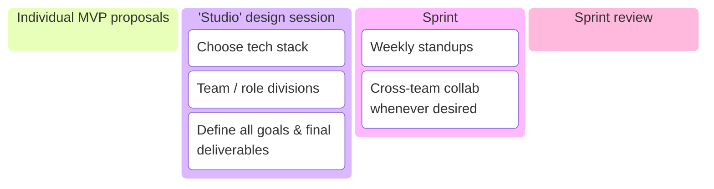
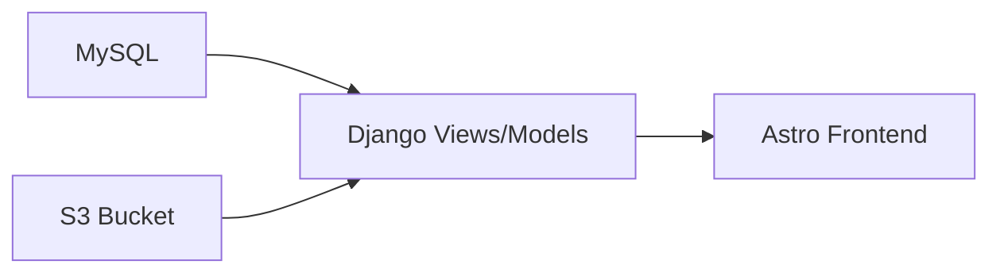
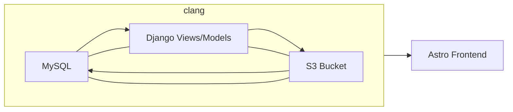
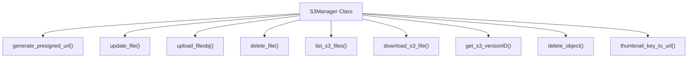

## Summary

In a collaboration with 13 other students in the Computer Graphics department at Penn, we created **PAPAYA** -- a web-deployed asset browser showcasing a database of our own past 3D-modeling work (as CG majors, we have a LOT of these).

Our browser is:

1. Built on a custom [OpenUSD](https://openusd.org/release/index.html) asset structure
2. Targets artists, programmers, and other members of the 3D graphics industry
3. Features:
    1. Version control (commit history, check-in/check-out)
    2. Tag-based search
    3. Interaction via live-previewing on the web + automatic import into a [Houdini](https://www.sidefx.com/) workspace.

Throughout the process, I acted in a **technical lead position**, specializing in building our USD composition arcs workflow and implementing asset resolving + versioning.

## Motivation

Within practically every game development or animation studio pipeline, there is a need for 3D asset storage and browsing. The experience within such a database is core to the productivity and organization of the studio's artists and engineers alike. Seeing this prominent use case, our team of students at Penn set out to create a 3D asset browser that prioritizes 1. scaleability, 2. modularity, and 3. interdepartmental collaboration.

## Achievements

My primary individual accomplishment was to:

- [1.](#versioned-asset-resolver) Implement a **versioned asset resolver** for our database and backend server.

My other two most notable contributions were:

- [2.](#custom-usd-structure) Helping to design a custom asset structure utilizing **USD composition arcs**

- [3.](#threejs-web-viewer) Supporting a built-in frontend **Three.JS web viewer for USD**

## Next Steps

- [ ] Explore **Assembly-level USD compositions**, enabling more complex multi-asset layouts beyond the scope of the initial sprint
- [ ] Revisit the idea of a native **Three.JS USDZLoader** as web-related USD development matures — evaluate performance, material fidelity, and potential integration in-place of current **USD->glTF->Three.JS** workaround method.
    - [ ] Contribute to the [**three-usdz-loader**](https://github.com/ponahoum/three-usdz-loader) open source repo. Improve its support for material-binding and geometry "Mesh prim" handling.

---

# Method

A unique goal of this project was to simulate the graphics pipeline within a small studio team. Our process followed the structure below:



## Versioned Asset Resolver

{insert gif here}

Asset Resolution in OpenUSD is a very worthy topic of discussion. I will take an excerpt from a website called USD Survival Guide to help explain the concept:

> You can kind of think of your asset resolver as a little black box that takes an input path, processes it and spits out a file path/URI that can be opened as a file/streamed data from.
>
> <cite>[USD Survival Guide](https://lucascheller.github.io/VFX-UsdSurvivalGuide/pages/core/plugins/assetresolver.html)</cite>

I personally define it as the internally used system of locating USD files in every context, be it runtime-related (e.g. loading up a scene that contains specific versions of an asset) or workflow-related (e.g. easily locating files in a studio's 10,000+ asset database).

In the context of our 14-person project, this meant designing a resolver that would play nicely with everybody's individual features. A multi-faceted ask for sure, considering we had a check-in/check-out system, DCC integrations (Houdini), and on and on (14 CG students can make A LOT of features).

To breakdown the task, I decided that _versioning_ was the primary bottleneck of our current asset resolving. We had ensured that everybody's individual 3D-models had commit history metadata, but this data was not yet handled in either MySQL or S3. By standardizing versioning + storage in both of these locations, then providing API endpoints via our Django backend, I could encapsulate and solve asset resolving needs within everybody's respective workflows.

My trajectory was set. I would go through and refactor functionality in the following order:



Though the first three were heavily interlaced, so it looked more like this:



(Get it? Because clang... is clang? Haha)

### MySQL "Sublayer" Structure


Within MySQL, the `Sublayer` table is essential to the asset resolver system. A `Sublayer` row shares conceptual similarities with a layer in USD, having a 1:1 correspondence with a `.usd` file but a _many-to-one_ correspondence with an `Asset`. It also contains columns for `s3_versionID` and `previousVersion_id`.

> [!NOTE]
> At first glance, storing `previousVersion_id` seems slightly unintuitive. Shouldn't that be stored with either commits or assets? However, know that when an USD asset contains multiple layer files, there are many times when certain layers will increment, but others won't. Storing version info within `Sublayer` covers that scenario.

To complete this refactor step, I took care to make my changes to the database replicable.

(I quickly learned my lesson after accidentally using an `UPDATE` command on our production DB, rather than the test. Thankfully, it was harmless, as update commands go)

I found that the easiest way to do this was via Django models and the [Django custom admin commands](https://docs.djangoproject.com/en/5.2/howto/custom-management-commands/) concept.

```python title="library/management/command/commits.py"
class Command(BaseCommand):
    help = """Easily refactor Commit objects in database."""

    def handle(self, *args, **options):
        if click.confirm(f"Fixing timestamp-related commit history. Continue?"):
            self.fixCommitTimestamps()
        if click.confirm('Refactoring 1.x commit versions to 0x.00.00 versions. Continue?'):
            self.standardizeCommitVersionSyntax()
	...
```

<cite>[Backend Repo](https://github.com/CIS-7000-sp25/backend/blob/main/library/management/commands/commits.py)</cite>

### Refactoring Amazon S3 and Code Collabs

S3 has built-in [versioning of objects](https://docs.aws.amazon.com/AmazonS3/latest/userguide/Versioning.html). Furthermore, an S3 bucket seems to naturally emulate a local file folder structure. Thus, the idea was to take our class assets, pre-organized to fit our custom USD structure (detailed [here](#custom-usd-structure)), and import them into the bucket as-is, while simultaneously extracting the updated `versionId` property to store within MySQL.

```bash
Dev ~ % aws s3 ls s3://cis-7000-usd-assets/ --recursive --summarize | grep "Total"

                           Assets/
                           Assemblies/
                           DCC/
                           ...

Total Objects: 817
   Total Size: 273902365
```

For this process, the most enjoyable task was collaborating with some of my peers, who had done an amazing job of building the workflow between Django (aka the backend of our browser) and S3. I learned a lot from reading their committed code and asking them about their design decisions. For example, before, when I interacted with most APIs, I would simply jump right into writing my own functions. This would often cause bloated code upfront, writing repeated simple "GET" and "PUT" functionality until I got around to creating helper classes & functions.

On the other hand, my peers demonstrated how they chose to first write a wrapper around the S3 client:



The `S3Manager` class was simple logic-wise, yet I could see how beneficial it was for the organization of our backend. I took care to make note of this and other coding tricks + niche design choices that were evident within this project. And overall, I took full advantage of the opportunity to collaborate with so many of the brilliant, knowledgable minds within my university department.

### Checkin/Checkout Views for Django Backend

As part of our versioning pipeline, I implemented several Django API endpoints to handle asset upload, access, and check-in/check-out functionality. These views emphasized modularity, reusability via serializers, and usability by other developers through auto-generated Swagger documentation.

**Core Functionality**:

Our check-in/check-out logic enforces a **“single artist at a time” policy**:

- When an asset is checked out, a `checked_out_by` field in the MySQL database is updated to indicate the current owner.
- Other users are still able to **download** the asset, but attempts to check it out will be blocked if the flag is set.
- This guarantees collaboration safety while maintaining accessibility for review and integration.

**Backend Architecture**:

I created or contributed to the following key endpoints:

- `post_asset()` and `put_asset()` in `library/views_upload.py`
    - `post_asset()` handles new asset uploads and initializes their metadata.
    - `put_asset()` supports updates to existing assets and enforces check-in behavior.
- `download_asset_by_commit()` and `download_asset_by_tag()` in `library/views_download.py`
    - These endpoints support version-specific asset retrieval, giving users control over which historical state they wish to fetch.

All views use corresponding serializers defined in `library/serializers.py`, which:

- Cleanly enforce validation of incoming request data
- Simplify model transformations
- Make each endpoint modular and testable

**Developer-Facing Documentation:**

To support the large team collaborating on this project, I also integrated **Swagger/OpenAPI** support. This exposed:

- `/docs` – A reference page showing the full list of endpoints, accepted fields, return schemas, and status codes.
- `/playground` – An interactive API tester, allowing other developers to upload and query assets directly from their browser.

{insert gif here}

This proved useful for other team members building on top of the API. For example, those working on DCC integration needed to be able to put assets into our database / S3 using a Houdini shelf tool, so they could reference `/docs` for the `PUT` schema of the `put_asset()` view within our . On the other hand, our frontend team created outward-facing UI, thus making use of the `/playground` feature to easily test out the return type of the `download_asset_by_tag()` endpoint, etc.

## Custom USD Structure

To support a collaborative, multi-contributor pipeline, we developed a custom USD asset structure organized around **contrib-based layering**. We enjoyed that this structure innately reflected the way our team worked: different members would contribute geometry, material, and organizational logic over time, and our directory layout needed to support that flow with clarity and modularity.

The structure was tailored to our own needs but also took **inspiration from established practices** — in particular, NVIDIA’s [_da Vinci’s Workshop_ dataset](https://docs.omniverse.nvidia.com/usd/latest/usd_content_samples/davinci_workshop.html), which also uses a `contrib/` pattern to separate layers by functionality. That reference helped reinforce our decision to adopt a flexible but standardized way of handling composition.

---

**Directory Layout:**

Under our design, we decided that each asset should reside under the `Assets/` directory in the following hierarchy:

```bash
Assets/
└── assetName/
    ├── assetName.usda # Root layer to reference contribs
    └── contrib/
        ├── geometry/
        │   ├── geometry.usda
        │   ├── bbox/
        │   │   └── geometry_bbox.usda
        │   ├── LOD0/
        │   │   └── geometry_LOD0.usda
        │   ├── LOD1/
        │   │   └── geometry_LOD1.usda
        │   └── LOD2/
        │       └── geometry_LOD2.usda
        └── material/
            ├── material.usda
            ├── default/
            │   ├── material_default.usda
            │   └── texture/
            │       └── default.png
            ├── plastic/
            │   ├── material_plastic.usda
            │   └── texture/
            │       └── plastic.png
            └── metal/
                ├── material_metal.usda
                └── texture/
                    └── metal.png
```

Each asset’s root `.usda` file served as a **single authoritative entry point** that composited together all modular contributions. From this root, references unfolded **layer by layer** — starting with top-level geometry and material references, then expanding into deeper sublayers like LOD variants or per-material texture maps. This hierarchical unfolding made each asset **introspectable at a glance**, while still allowing contributors to work at fine-grained levels without touching the root.

---

**Composition Arcs:**

To adopt best practices and standards, we integrated several core USD composition arcs. Briefly:

- **`reference` arcs** connected the root layer to subsequent layers
- **`variantset` arcs** were applied within each `contrib`, such as LOD switching within the geometry `contrib`.
- **`payload` arcs** greatly optimized performance. For example `LOD0`, which often exceeded 80mb size, was on default hidden by a payload.
- **`class` and `inherits`:** each material that an asset needed was assigned its own `class` within a `MaterialClasses` **Scope** that could be accessed throughout the entire stage. This effectively allowed the usage of a simple `inherits` keyword to bind a geometry prim to a desired material.

```usda
def Scope "MaterialClasses"
	{
		over "class_Default"
		{
			prepend rel material:binding = </campfire/Materials/mat_Default>
		}
		over "class_Rocks"
		{
			prepend rel material:binding = </campfire/Materials/mat_Rocks>
		}
		over "class_Logs"
		{
			prepend rel material:binding = </campfire/Materials/mat_Logs>
		}
	}
```

---

**Assemblies, DCCs, and Overall Extensibility**:

At the top level, there is also the `Assemblies/` and `DCCs` directory. This is what would allow for larger scene compositions to be included, if desired (no dedicated task for assemblies was initiated during this sprint).

```bash
└── Assemblies/
└── Assets/
└── DCCs/
```

We were proud of the design choice in making these topmost folders in themselves another "layer". Another layer represents another layer of flexibility and abstraction -- essentially, what's to say that `Assemblies/` and `DCCs` couldn't follow a completely different rulebook, entirely?

---

** Documentation and Supporting Project-wide Workflows:**

To assist all project contributors in adopting this structure, I decided to create a collection of resources to explain the thought process and use-cases behind our custom USD structure. Most notably:

- A [demo video](https://www.youtube.com/watch?v=hNuHniOKjt4) in USDView walking through an example asset, demonstrating how to switch through different geometry variants, and view the inherited material binding for a given geometry prim.
- A visual [workflow presentation](https://drive.google.com/file/d/1ZxiKbZk2xu4kw1len1eW1ywzZlvCVUjK/view) outlining what is possible with this structure. Namely, walks through a "check-in/check-out" workflow, and details the thought process of a potential **geometry artist** as well as a **material artist**.


- A [GitHub reference repo](https://github.com/) containing dummy assets, layer templates, example Python scripting routes, and an extensive README tailored towards my fellow contributors.

If I'm being honest, documentation has never been the easiest part of my workflow. But it felt meaningful here — knowing that anyone on the team could navigate the structure and understand not just how things worked, but why.

Overall, this custom USD structure acted as the structural foundation of our asset browser, PAPAYA. We are happy with how it balances flexibility for artistic creativity ]with conceptual best practices using OpenUSD composition arcs and archetypal datasets.

## Three.JS Web Viewer

Early on during the MVP stage of the project, I explored the idea of creating an in-browser rendered view of our assets by building a working prototype of a **Three.JS** and **USD-to-glTF conversion pipeline**.

This became a foundational concept for the deployed frontend: enabling users to preview our browser's assets quickly and with high-quality, right on the web.

---

**From Concept to MVP:**

At the MVP stage, we were still deciding what our final tech stack and browser deliverables would be. In addition to helping with these tasks, I personally wanted to test whether it was possible to view asset geometry and material appearance quickly and interactively using client-side rendering alone.

I wrote a lightweight viewer, `gltf_viewer.js`, structured around Three.JS’s `GLTFLoader`. It enabled basic orbiting, lighting, and material visualization from uploaded `.gltf` files — which were converted from our USD assets through an intermediary [Blender](https://www.blender.org/) script.

Here’s what the viewer looked like in the MVP:

{insert gif here}

To get this MVP running, throughout a one-week period I worked through the following tasks:

1. Research state-of-the-art on USD web interfaces, as it is still very early in development.
    - Although there is one proprietary [USDZLoader for Three.JS](https://github.com/ponahoum/three-usdz-loader) package available, I noticed that there were often material-loading issues and missing geometry. I made a decision to opt for GLTF-conversion.
2. Experiment with **[Webpack-based](https://webpack.js.org/) static file bundling**, creating a local bundle system for building frontend scripts (e.g. `gltf_viewer.js`) and collecting Three.JS dependencies.
3. Learn how to properly serve and load static files properly in a Django project.

---

Thanks to other amazing teammates, in the final Astro-based frontend, the integrated Three.JS + glTF viewer offers much more brilliant features than my rough baseline, such as environmental lighting and shading options (PBR, Toon, etc) -- navigate [here](https://asset-browser-zeta.vercel.app/asset/jelloShelf) and press "Preview model in browser" to test it out yourself. I'm glad that the MVP helped verify that the concept was feasible early in the process, and hope to continue taking such chances to self-explore and understand new concepts and tech libraries.
