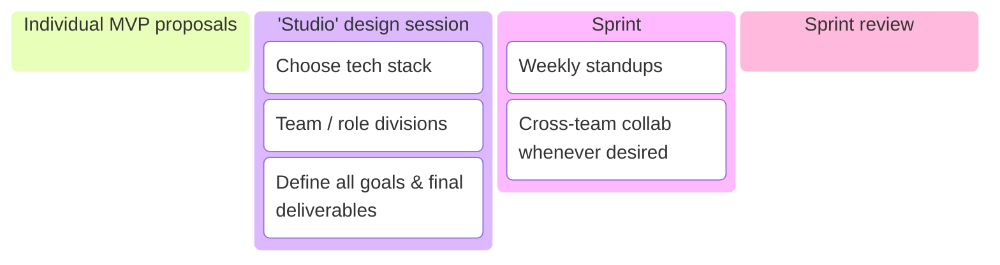
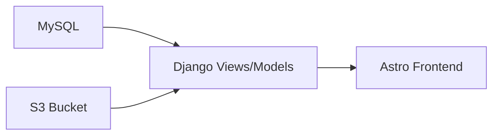
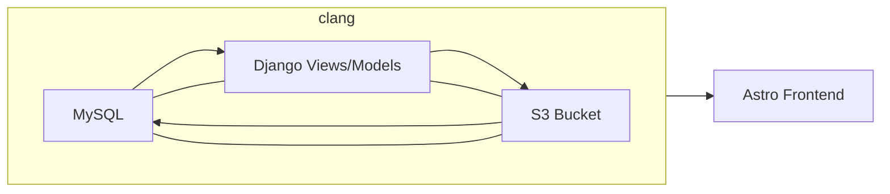

## Summary

In a collaboration with 13 other students in the Computer Graphics department at Penn, we created **PAPAYA** -- a web-deployed asset browser showcasing a database of our own past 3D-modeling work (as CG majors, we have a LOT of these).

Our browser is:

1. Built on a custom [OpenUSD](https://openusd.org/release/index.html) asset structure
2. Targets artists, programmers, and other members of the 3D graphics industry
3. Features:
    1. Version control (commit history, check-in/check-out)
    2. Tag-based search
    3. Interaction via live-previewing on the web + automatic import into a [Houdini](https://www.sidefx.com/) workspace.

Throughout the process, I acted in a **technical lead position**, specializing in building our USD composition arcs workflow and implementing asset resolving + versioning.

## Motivation

Within practically every game development or animation studio pipeline, there is a need for 3D asset storage and browsing. The experience within such a database is core to the productivity and organization of the studio's artists and engineers alike. Seeing this prominent use case, our team of students at Penn set out to create a 3D asset browser that prioritizes 1. scaleability, 2. modularity, and 3. interdepartmental collaboration.

## Achievements

My primary individual accomplishment was to:

- [1.](#versioned-asset-resolver) Implement a **versioned asset resolver** for our database and backend server.

My other two most notable contributions were:

- [2.](#custom-usd-structure) Helping to design a custom asset structure utilizing **USD composition arcs**

- [3.](#threejs-web-viewer) Supporting a built-in frontend **Three.JS web viewer for USD**

## References

1. [NVIDIA "da Vinci's Workshop"](https://docs.omniverse.nvidia.com/usd/latest/usd_content_samples/davinci_workshop.html)
2. [NVIDIA "Residential Lobby"](https://docs.omniverse.nvidia.com/usd/latest/usd_content_samples/res_lobby.html)
3. [NVIDIA Nucleus Server Structure](https://docs.omniverse.nvidia.com/nucleus/latest/index.html)
4. [Disney Animation "Moana"](https://disneyanimation.com/resources/moana-island-scene/)

---

# Method

A unique goal of this project was to simulate the graphics pipeline within a small studio team. Our process followed the structure below:

## Versioned Asset Resolver

{insert gif here}

Asset Resolution in OpenUSD is a very worthy topic of discussion. I will take an excerpt from a website called USD Survival Guide to help explain the concept:

> You can kind of think of your asset resolver as a little black box that takes an input path, processes it and spits out a file path/URI that can be opened as a file/streamed data from.
> [src](https://lucascheller.github.io/VFX-UsdSurvivalGuide/pages/core/plugins/assetresolver.html)

I personally define it as the internally used system of locating USD files in every context, be it runtime-related (e.g. loading up a scene that contains specific versions of an asset) or workflow-related (e.g. easily locating files in a studio's 10,000+ asset database).

In the context of our 14-person project, this meant designing a resolver that would play nicely with everybody's individual features. A multi-faceted ask for sure, considering we had a check-in/check-out system, DCC integrations (Houdini), and on and on (14 CG students can make A LOT of features).

To breakdown the task, I decided that _versioning_ was the primary bottleneck of our current asset resolving. We had ensured that everybody's individual 3D-models had commit history metadata, but this data was not yet handled in either MySQL or S3. By standardizing versioning + storage in both of these locations, then providing API endpoints via our Django backend, I could encapsulate and solve asset resolving needs within everybody's respective workflows.

My trajectory was set. I would go through and refactor functionality in the following order:

Though the first three were heavily interlaced, so it looked more like this:

(Get it? Because clang...is clang? Haha)

### MySQL

## Custom USD Structure

## Three.JS Web Viewer
