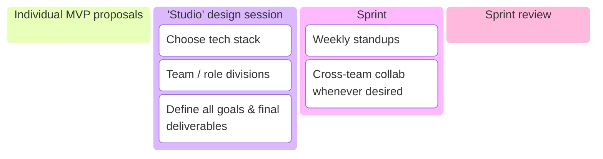
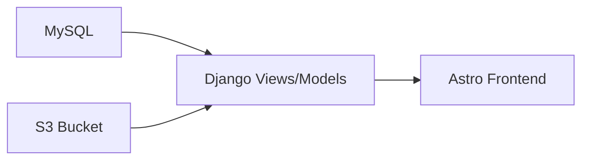
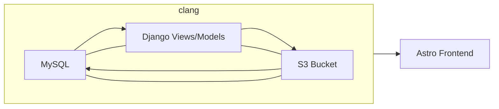
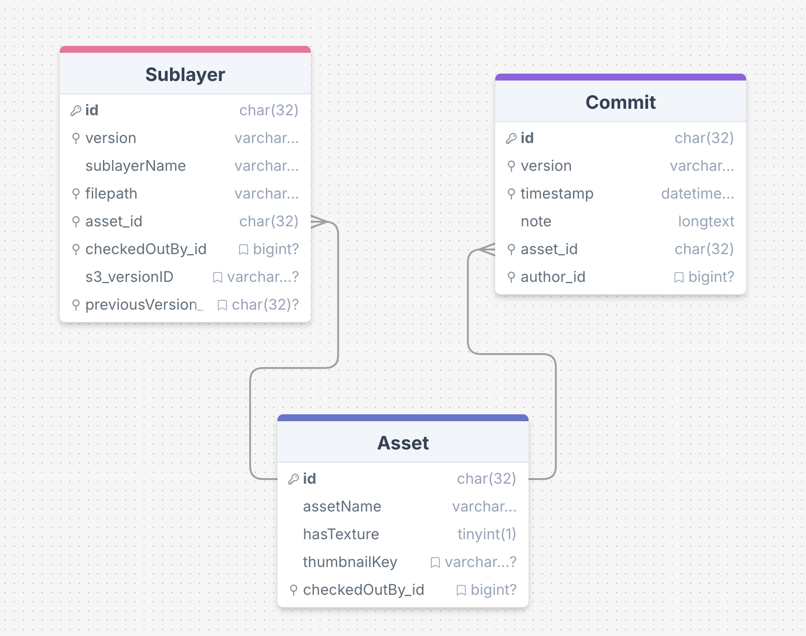
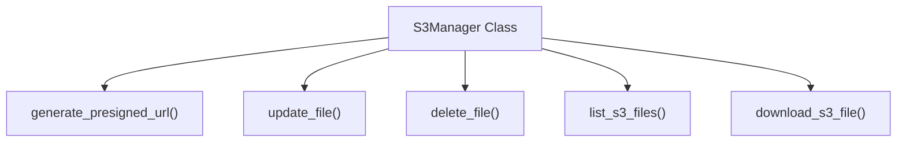
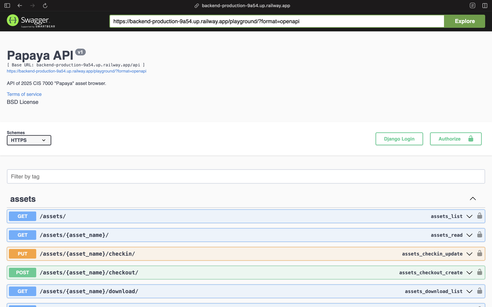
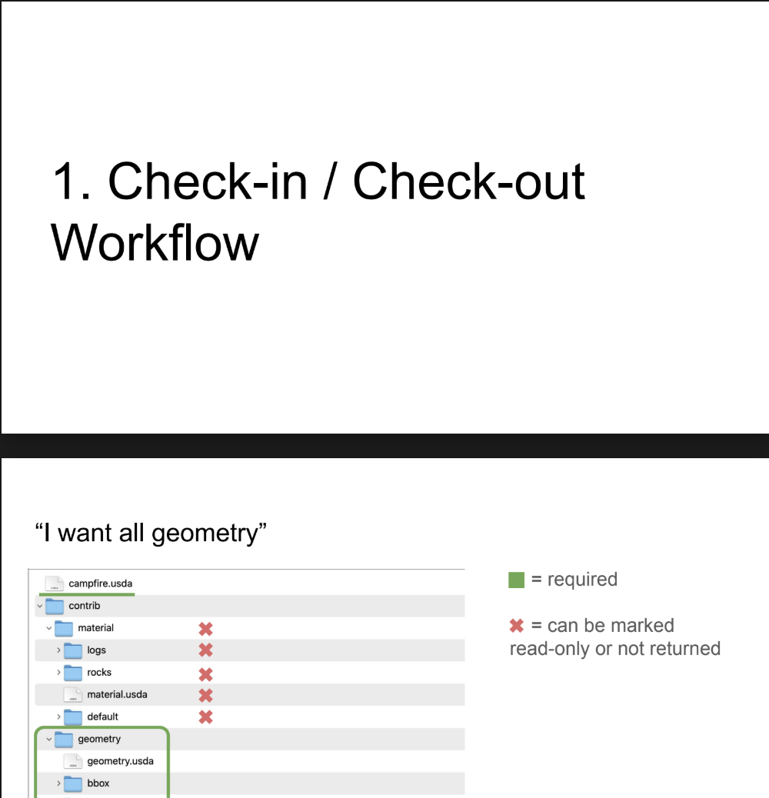

## Summary

**PAPAYA** is a web-based asset browser designed to facilitate collaborative management and previewing of OpenUSD 3D assets. Developed by a team of 14 students in the Computer Graphics department at the University of Pennsylvania, the platform integrates a custom OpenUSD asset structure with a Django backend, MySQL database, and Amazon S3 cloud storage.

The browser supports:

- Version-controlled asset management with check-in/check-out functionality
- Tag-based search and metadata querying
- Web-based 3D asset preview via a Three.JS viewer, with support for direct integration into digital content creation (DCC) tools such as Houdini

I contributed as a technical lead, focusing on asset versioning and resolution infrastructure. My work included designing the USD composition workflow, implementing resolver logic across the database and cloud storage, and contributing to the system's extensibility and developer documentation.

## Motivation

Modern game and animation studios require scalable infrastructure to store, browse, and collaborate on 3D assets. These systems are essential not only for artists to access production-ready content, but also for technical teams to maintain consistency across complex pipelines.

Recognizing this industry need, our team set out to develop a collaborative 3D asset browser that emphasizes:

1. **Scalability** – supporting growing asset libraries and multi-versioned contributions
2. **Modularity** – enabling flexible integration across DCC tools and web platforms
3. **Interdisciplinary workflows** – streamlining collaboration between artists, technical directors, and developers

By combining OpenUSD’s composition model with a modern web backend, PAPAYA serves as both a practical tool and a proof-of-concept for studio-grade asset management in an academic setting.

## Achievements

As technical lead, I focused on core infrastructure to support asset resolution, storage, and interactivity. My primary contributions included:

- Designing and implementing a **versioned asset resolver**, integrating metadata across MySQL and Amazon S3 to support multi-version workflows
- Co-developing a **custom OpenUSD asset structure** that leveraged composition arcs for modular layering, material binding, and LOD management
- Prototyping and validating a **Three.JS-based web viewer** for interactive preview of glTF-converted USD assets, which later informed the design of the final frontend

## Next Steps

- [ ] Explore **Assembly-level USD compositions**, enabling more complex multi-asset layouts beyond the scope of the initial sprint
- [ ] Revisit the idea of a native **Three.JS USDZLoader** as web-related USD development matures — evaluate performance, material fidelity, and potential integration in-place of current **USD->glTF->Three.JS** workaround method.
    - [ ] Contribute to the [**three-usdz-loader**](https://github.com/ponahoum/three-usdz-loader) open source repo. Improve its support for material-binding and geometry "Mesh prim" handling.

---

## Method

A unique goal of this project was to simulate the graphics pipeline within a small studio team. We organized work around sprint cycles, beginning with individual MVP proposals and culminating in a shared architecture that balanced backend reliability with frontend usability.



### Versioned Asset Resolver

Asset resolution in OpenUSD involves mapping logical asset paths to physical file locations—often across multiple layers, tools, or storage backends. For this project, we needed a resolver that could support:

- Multi-versioned assets with commit history
- Layer-based composition in USD
- Compatibility with MySQL, Amazon S3, and Django-based APIs

The primary bottleneck was the lack of integrated versioning between our database and cloud storage. While commit metadata existed per asset, it was not consistently tracked or accessible across systems.

To address this, I refactored the backend in three coordinated layers:



Though ultimately, we realized that the systems were heavily interconnected, so it looked more like this:



(Get it? Because clang... is clang?)

#### MySQL "Sublayer" Structure



In support of version-aware asset resolution, we introduced a `Sublayer` table to the MySQL schema. Each `Sublayer` corresponds to a physical `.usd` file and maintains a many-to-one relationship with an `Asset` entry. This design enables fine-grained tracking of individual USD layers within a composite asset.

Key columns include:

- `s3_versionID`: references the corresponding object version in Amazon S3
- `previousVersion_id`: links to the prior version of the same sublayer

Initially, version tracking was considered at the asset or commit level. However, because USD assets may consist of multiple independently evolving sublayers, tracking version history at the sublayer level offered greater precision—particularly when only specific components (e.g., a LOD variant or material file) change between commits.

To integrate this logic into the development pipeline, I extended our Django models and created reusable [Django custom admin commands](https://docs.djangoproject.com/en/5.2/howto/custom-management-commands/) for database maintenance. These tools allowed contributors to standardize version syntax, patch historical inconsistencies, and maintain reproducibility across environments.

```python
# library/management/command/commits.py
class Command(BaseCommand):
  help = """Easily refactor Commit objects in database."""

  def handle(self, *args, **options):
    if click.confirm(f"Fixing timestamp-related commit history. Continue?"):
      self.fixCommitTimestamps()
    if click.confirm('Refactoring 1.x commit versions to 0x.00.00 versions. Continue?'):
      self.standardizeCommitVersionSyntax()
	...
```

#### Refactoring Amazon S3 and Code Collabs

To complement the versioning system in MySQL, we leveraged Amazon S3’s native object versioning to manage file-level history for all USD sublayers. The structure of our S3 bucket mirrored the organization of our USD assets, preserving their directory layout and enabling direct mapping between local files and cloud objects.

As assets were uploaded to S3, their corresponding `versionId` values were extracted and stored in the MySQL `Sublayer` table. This allowed the backend to reference a specific state of any file, ensuring consistency between database metadata and actual stored content.

```bash title="bash"
$ aws s3 ls s3://cis-7000-usd-assets/ --recursive | grep "Total"

Total Objects: 817
   Total Size: 273902365
```

In building this pipeline, I collaborated closely with teammates who developed the S3 interface layer. Their implementation of a centralized `S3Manager` class provided a clean abstraction over AWS SDK calls and significantly improved maintainability:



This wrapper pattern reinforced the importance of modular backend design. It also allowed me to streamline resolver logic and maintain a consistent interface between asset metadata and its physical representation in storage.

Through this collaborative backend effort, we achieved version parity across MySQL and S3 while improving clarity and extensibility in the codebase.

#### Checkin/Checkout Views

To support collaborative editing and version control, I implemented a check-in/check-out system on top of our Django backend. This system enforces edit locks at the asset level, ensuring safe concurrent use across team members while maintaining traceable asset histories.

##### Access Control Logic

The workflow enforces a **single-user ownership model** during check-out:

- When a user checks out an asset, the `checked_out_by` field in the database is updated with their identifier
- While other users can still download the asset, further check-out attempts are blocked until it is checked back in
- This policy safeguards against overwriting and promotes structured review and integration

##### Endpoint Development

I developed and maintained key API endpoints to support this workflow:

- `post_asset()` and `put_asset()` in `library/views_upload.py`
    - `post_asset()` initializes asset metadata and uploads new files
    - `put_asset()` validates check-in logic and updates existing entries

- `download_asset_by_commit()` and `download_asset_by_tag()` in `library/views_download.py`
    - Enables precise retrieval of asset versions based on metadata selectors

Each view is structured around a corresponding serializer in `library/serializers.py`, ensuring:

- Input validation and error handling
- Clean model transformations
- Reusability and testability of endpoint logic

##### Developer-Facing Documentation

To ensure smooth adoption by a large, multidisciplinary team, I integrated **Swagger/OpenAPI** documentation into the backend:

- `/docs` – Auto-generated reference of all endpoints, expected schemas, and return types
- `/playground` – Interactive API testing interface directly in the browser
  

This was particularly useful for downstream developers:

- Those building DCC integrations could refer to `/docs` to match their shelf tools to PUT schemas
- The frontend team leveraged `/playground` to test response formats and preview integration behavior

By combining clear access logic with modular API design and strong developer support, the check-in/check-out system became a reliable component for team-wide collaboration.

### Custom USD Structure

To support a collaborative, multi-contributor pipeline, we developed a custom USD asset structure organized around **contrib-based layering**. We enjoyed that this structure innately reflected the way our team worked: different members would contribute geometry, material, and organizational logic over time, and our directory layout needed to support that flow with clarity and modularity.

The structure was tailored to our own needs but also took **inspiration from established practices** — in particular, NVIDIA’s [_da Vinci’s Workshop_ dataset](https://docs.omniverse.nvidia.com/usd/latest/usd_content_samples/davinci_workshop.html), which also uses a `contrib/` pattern to separate layers by functionality. That reference helped reinforce our decision to adopt a flexible but standardized way of handling composition.

#### Directory Layout

Assets were organized under a top-level `Assets/` directory, with each asset containing a root `.usda` file and a `contrib/` subfolder for structured layers:

```bash title="bash"
Assets/
└── assetName/
  ├── assetName.usda # Root layer to reference contribs
  └── contrib/
    ├── geometry/
    │   ├── geometry.usda
    │   ├── bbox/
    │   │   └── geometry_bbox.usda
    │   ├── LOD0/
    │   │   └── geometry_LOD0.usda
    │   ├── LOD1/
    │   │   └── geometry_LOD1.usda
    │   └── LOD2/
    │       └── geometry_LOD2.usda
    └── material/
      ├── material.usda
      ├── default/
      │   ├── material_default.usda
      │   └── texture/
      │       └── default.png
      ├── plastic/
      │   ├── material_plastic.usda
      │   └── texture/
      │       └── plastic.png
      └── metal/
        ├── material_metal.usda
        └── texture/
          └── metal.png
```

Each asset’s root `.usda` file served as a **single authoritative entry point** that composited together all modular contributions. From this root, references unfolded **layer by layer** — starting with top-level geometry and material references, then expanding into deeper sublayers like LOD variants or per-material texture maps. This hierarchical unfolding made each asset **introspectable at a glance**, while still allowing contributors to work at fine-grained levels without touching the root.

#### Composition Arcs

We used core USD composition arcs to define asset behavior. Briefly:

- **`reference` arcs** connected the root layer to subsequent layers
- **`variantset` arcs** were applied within each `contrib`, such as LOD switching within the geometry `contrib`.
- **`payload` arcs** greatly optimized performance. For example `LOD0`, which often exceeded 80mb size, was on default hidden by a payload.
- **`class` and `inherits`:** each material that an asset needed was assigned its own `class` within a `MaterialClasses` **Scope** that could be accessed throughout the entire stage. This effectively allowed the usage of a simple `inherits` keyword to bind a geometry prim to a desired material.

For example, we defined a `MaterialClasses` scope containing `class_` prims, allowing assets to bind materials via inheritance:

```usda
// Assets/campfire/contrib/material/material.usda
def Scope "MaterialClasses"
	{
		over "class_Default"
		{
			prepend rel material:binding = </campfire/Materials/mat_Default>
		}
		over "class_Rocks"
		{
			prepend rel material:binding = </campfire/Materials/mat_Rocks>
		}
		over "class_Logs"
		{
			prepend rel material:binding = </campfire/Materials/mat_Logs>
		}
	}
```

This promoted reuse and ensured materials could be consistently referenced across assets without duplication.

#### Assemblies, DCCs & Extensibility

The root directory also included:

```bash title="bash"
└── Assemblies/
└── Assets/
└── DCCs/
```

While `Assets/` housed atomic models, `Assemblies/` was reserved for larger scene compositions, and `DCCs/` for integration scripts or source workspace files. These directories were treated as additional layers, giving contributors the freedom to adopt different rulesets where needed.

#### Documentation & Workflows

To assist all project contributors in adopting this structure, I developed a suite of supporting materials:

- A [demo video](https://www.youtube.com/watch?v=hNuHniOKjt4) in USDView walking through an example asset, demonstrating how to switch through different geometry variants, and view the inherited material binding for a given geometry prim.
- A visual [workflow presentation](https://drive.google.com/file/d/1ZxiKbZk2xu4kw1len1eW1ywzZlvCVUjK/view) outlining what is possible with this structure. Namely, walks through a "check-in/check-out" workflow, and details the thought process of a potential **geometry artist** as well as a **material artist**.



- A [GitHub reference repo](https://github.com/) containing dummy assets, layer templates, example Python scripting routes, and an extensive README tailored towards my fellow contributors.

### Three.JS Web Viewer

To enable real-time asset inspection directly in the browser, I developed an initial prototype of a **Three.JS-based viewer** for glTF-converted USD files. This early MVP laid the groundwork for the final frontend integration and validated the feasibility of web-based asset previewing within our pipeline.

#### MVP Development

During the initial sprint, I implemented a proof-of-concept viewer using Three.JS’s `GLTFLoader`. This viewer supported:

- Basic lighting and shading
- Interactive camera orbit controls
- Visualization of geometry and materials converted from USD

The pipeline converted USD files to `.gltf` format using Blender scripts, allowing compatibility with Three.JS rendering. This decision was made after evaluating other options such as USDZ and `three-usdz-loader`, which showed inconsistent material and geometry handling.

At the time, our MVP used both a Django-based backend and frontend. So to support the viewer feature, I also experimented with:

- **Webpack-based bundling** for static assets
- Integration of JavaScript modules into Django templates
- Static file routing and serving for frontend deployment

The MVP was functional and helped define the asset preview feature’s technical constraints and opportunities.


In the final AstroJS-based frontend, a more robust Three.JS viewer was integrated by the frontend team. It includes additional features such as:

- Environmental lighting
- Multiple shading models (e.g., PBR, Toon)
- Responsive UI controls

Example: [Live asset preview – Jello Shelf](https://asset-browser-zeta.vercel.app/asset/jelloShelf)

Navigate to the link above and press "Preview model in browser" to test out the feature in production.
