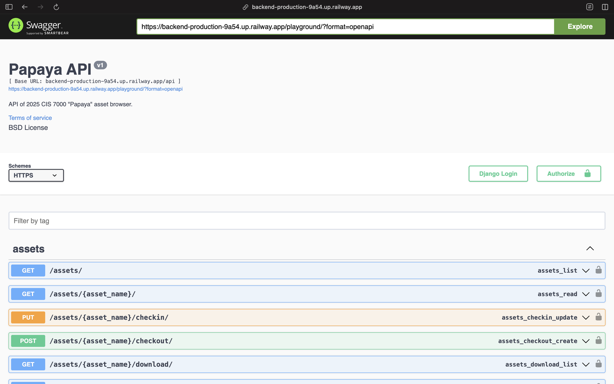
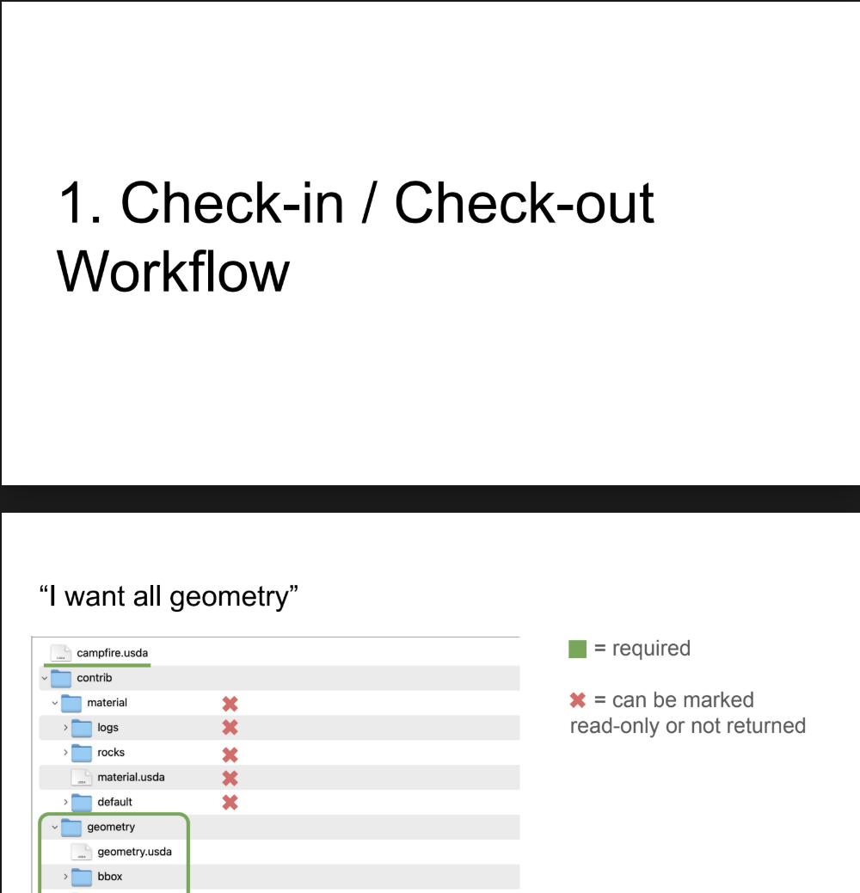
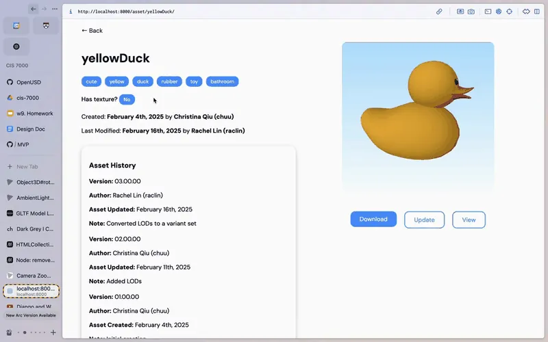
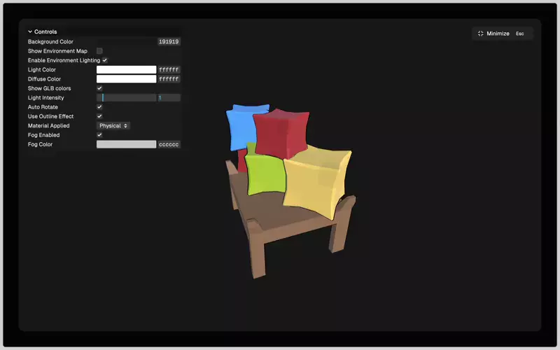

## Summary

**PAPAYA** is a web-based asset browser designed to facilitate collaborative management and previewing of OpenUSD 3D assets. Developed by a team of 14 students in the Computer Graphics department at the University of Pennsylvania, the platform integrates a custom OpenUSD asset structure with a Django backend, MySQL database, and Amazon S3 cloud storage.

The browser supports:

- Version-controlled asset management with check-in/check-out functionality
- Tag-based search and metadata querying
- Web-based 3D asset preview via a Three.JS viewer, with support for direct integration into digital content creation (DCC) tools such as Houdini

Working alongside my wonderful peers, I focused on two things: personally building an asset resolver infrastructure for the platform and overall project environment, and collaboratively designing the project-wide USD asset structure and schemas.

## Motivation

Modern game and animation studios require scalable infrastructure to store, browse, and collaborate on 3D assets. These systems are essential not only for artists to access production-ready content, but also for technical teams to maintain consistency across complex pipelines.

Recognizing this industry need, our team set out to develop a collaborative 3D asset browser that emphasizes:

1. **Scalability** – supporting growing asset libraries and multi-versioned contributions
2. **Modularity** – enabling flexible integration across DCC tools and web platforms
3. **Interdisciplinary workflows** – streamlining collaboration between artists, technical directors, and developers

As students, we also hoped that through combining OpenUSD’s composition model with a modern web backend, PAPAYA serves as both a practical tool and a proof-of-concept for high-efficiency asset management in academic and small-team environments.

## Achievements

I focused on core infrastructure to support asset resolution, storage, and interactivity. My primary contributions included:

- Designing and implementing a **versioned asset resolver**, integrating data flow across MySQL and Amazon S3 to support multi-version asset history
- Co-developing a **custom OpenUSD asset structure** that leveraged composition arcs for modular layering, material binding, and LOD management
- Prototyping and validating a **Three.JS-based web viewer** for interactive preview of glTF-converted USD assets

## Next Steps

- [ ] Explore **Assembly-level USD compositions**, enabling more complex multi-asset layouts beyond the scope of the initial sprint
- [ ] Revisit the idea of a native **Three.JS USDZLoader** as web-related USD development matures — evaluate performance, material fidelity, and potential integration in-place of current **USD->glTF->Three.JS** workaround method.
    - [ ] Contribute to the [**three-usdz-loader**](https://github.com/ponahoum/three-usdz-loader) open source repo. Improve its support for material-binding and geometry "Mesh prim" handling.

## Method

Firstly, an unique goal of this project was to simulate the graphics pipeline within a small studio team. We organized work around sprint cycles, beginning with individual MVP proposals and culminating in a shared architecture that balanced backend reliability with frontend usability.

```d2
direction: right

(*** -> ***)[*]: {
	style.animated: true
}

I: {
	shape: class
	style.fill: "#d45017"
	label: "Individual MVP proposals"
	+Research: "Research desired tech stack"
	+MVP: "Develop & deploy\npresentable MVP"
}

S: {
	shape: class
	style.fill: "#8753b8"
	label: "'Studio' design session"
	+Tech: "Choose optimal tech stack"
	+Roles: "Team / role divisions"
	+Goals: "Define all goals & final deliverables"
}

P: {
	shape: class
	style.fill: "#9fb800"
	label: "Sprint"
	+Standups: "Weekly standups"
	+Collab: "Cross-team collaboration (as needed)"
}

R: {
	shape: class
	style.fill: "#0d92ba"
	label: "Sprint review"
	+Assess: "Assess achievement of deliverables"
	+Next: "Establish next steps"
}

I -> S -> P -> R
```

### Versioned Asset Resolver

Asset resolution in OpenUSD involves mapping logical asset paths to physical file locations—often across multiple layers, tools, or storage backends. For this project, we needed a resolver that could support:

- Multi-versioned assets with commit history
- Compatibility with MySQL, Amazon S3, and Django-based APIs
- Layer-based composition in USD

The primary bottleneck was the lack of consistent versioning among our different platforms. While commit metadata existed per asset in MySQL, and Amazon S3 has built-in versioning, this info had no communication with each other.

To address this, I worked on optimizing the data format in what appeared to be three coordinated layers:

```d2 layout=dagre theme=300
	direction: right

	(*** -> ***)[*]: {
		style.animated: true
	}

	MySQL.style.fill: "#194d80"
	S3: "S3 Bucket" {
		style.fill: "#e6bd45"
	}
	Django: "Django Models/Views" {
		style.fill: "#ee964b"
	}
	Astro: "Astro Frontend" {
		style.fill: "#f95738"
	}

	MySQL->Django
	S3->Django
	Django->Astro
```

Though ultimately, I realized that everything within the systems, Django included, were heavily interconnected, so my workflow started to look more like this:

```d2 layout=dagre theme=300
	direction: right

	(*** -> ***)[*]: {
		style.animated: true
	}

	clang: clang {
		style.text-transform: lowercase

		label.near: top-center

		# inner object styling
		MySQL.style.fill: "#194d80"
		S3: "S3 Bucket" {
			style.fill: "#e6bd45"
		}
		Django: "Django Models/Views" {
			style.fill: "#ee964b"
		}

		MySQL -> Django
		Django -> MySQL

		S3 -> Django
		Django -> S3

		MySQL -> S3
		S3 -> MySQL
	}

	Astro: "Astro Frontend" {
		style.fill: "#f95738"
	}

	clang -> Astro
```

(Get it? Because clang... is clang?)

The following three sections cover the specifics of refactoring each system.

#### MySQL "Sublayer" Structure

```d2
(*** -> ***)[*]: {
	style.animated: true
}
Sublayer: {
	shape: sql_table
	style.fill: "#e3c9c9"
	id: char(32) { constraint: primary_key }
	version: varchar(32)
	sublayerName: varchar(200)
	filepath: varchar(200)
	asset_id: char(32) { constraint: foreign_key }
	checkedOutBy_id: bigint
	s3_versionID: varchar(64)
	previousVersion_id: char(32)
}

Commit: {
	shape: sql_table
	style.fill: "#cecbcb"
	id: char(32) { constraint: primary_key }
	version: varchar(32)
	timestamp: datetime
	note: longtext
	asset_id: char(32) { constraint: foreign_key }
	author_id: bigint
}

Asset: {
	shape: sql_table
	style.fill: "#cbdadb"
	id: char(32) { constraint: primary_key }
	assetName: varchar(200)
	hasTexture: boolean
	thumbnailKey: varchar(200)
	checkedOutBy_id: bigint
}

Sublayer.asset_id -> Asset.id
Commit.asset_id -> Asset.id
```

Initially, at our class-wide MVP disccussions, we considered version tracking at either the `Asset` or `Commit` level. However, after downloading and looking through example datasets such as Disney's [Moana](https://www.disneyanimation.com/data-sets/?drawer=/resources/moana-island-scene/) and Pixar's [da Vinci's workshop](https://docs.omniverse.nvidia.com/usd/latest/usd_content_samples/davinci_workshop.html) , I realized that tracking version history at the `Sublayer` level would be necessary, allowing us to track changes in individual files (e.g., a LOD variant or material file) between commits. Thus, the `Sublayer` table was introduced to the MySQL schema.

Key columns include:

- `s3_versionID`: references the corresponding object version in Amazon S3
- `previousVersion_id`: links to the prior version of the same sublayer

To integrate this logic into the development pipeline, I extended our Django models and created reusable [Django custom admin commands](https://docs.djangoproject.com/en/5.2/howto/custom-management-commands/) for database maintenance. These tools allowed contributors to standardize version syntax and patch historical inconsistencies while maintaining reproducibility across environments.

```python
# library/management/command/commits.py
class Command(BaseCommand):
  help = """Easily refactor Commit objects in database."""

  def handle(self, *args, **options):
    if click.confirm(f"Fixing timestamp-related commit history. Continue?"):
      self.fixCommitTimestamps()
    if click.confirm('Refactoring 1.x commit versions to 0x.00.00 versions. Continue?'):
      self.standardizeCommitVersionSyntax()
	...
```

#### Refactoring Amazon S3 and Code Collabs

To complement the versioning system in MySQL, we leveraged Amazon S3’s native object versioning to manage file-level history for all USD sublayers. The structure of our S3 bucket mirrored the organization of our USD assets, preserving their directory layout and enabling direct mapping between local files and cloud objects.

As assets were uploaded to S3, their corresponding `versionId` values were extracted and stored in the MySQL `Sublayer` table. This allowed the backend to reference a specific state of any file, ensuring consistency between database metadata and actual stored content.

```bash title="bash"
$ aws s3 ls s3://cis-7000-usd-assets/ --recursive | grep "Total"

Total Objects: 817
   Total Size: 273902365
```

In building this segment of the resolver pipeline, I collaborated closely with teammates who developed the core S3 interface in the backend. Their implementation of a centralized `S3Manager` class provided a clean abstraction over AWS SDK calls and significantly improved maintainability:

```d2
style.double-border: true

S3Manager: S3Manager Class {
	shape: class
	style.fill: "#e6bd45"

	+generate_presigned_url(key, bucket, expires_in): str
	+update_file(file, key, bucket)
	+upload_fileobj(file, key, bucket)
	+delete_file(key, bucket)
	+list_s3_files(prefix, bucket): 'list[str]'
	+download_s3_file(key, bucket, versionId): bytes
	+get_s3_versionID(key, bucket, n): str
	+delete_object(key, bucket)
	+thumbnail_key_to_url(thumbnailKey, expires_in): str
}
```

This wrapper pattern reinforced the importance of modular backend design. It also allowed me to streamline resolver logic and maintain a consistent interface between asset metadata and its physical representation in storage.

Through this collaborative effort, we achieved versioning across MySQL and S3 while improving clarity and extensibility in the codebase.

#### Checkin/Checkout Views in Django

Next, to support collaborative editing and version control, I working on the check-in / check-out system within our Django backend. We made sure that our database enforces edit locks at the asset level, ensuring safe concurrent use among team members and maintaining traceable asset histories.

##### Access Control Logic

Specifically, the workflow enforces a **single-user ownership model** during check-out:

- When a user checks out an asset, the `checked_out_by` field in MySQL is updated with their identifier
- While other users can still download the asset, further check-out attempts are blocked until it is checked back in
  This policy safeguards against overwriting and promotes structured review and integration

##### Endpoint Development

I helped to develop and maintain key API endpoints to support this workflow:

- `post_asset()` and `put_asset()` in `library/views_upload.py`
    - `post_asset()` initializes asset metadata and uploads new files
    - `put_asset()` validates check-in logic and updates existing entries

- `download_asset_by_commit()` and `download_asset_by_tag()` in `library/views_download.py`
    - Enables precise retrieval of asset versions based on a "flags" system in the metadata.

I also wanted to structure each view around a corresponding serializer in `library/serializers.py`, ensuring:

- Input validation and error handling
- Clean model transformations
- Reusability and testability of endpoint logic

##### Developer-Facing Documentation

To wrap things up in Django, I integrated **Swagger/OpenAPI** documentation into the backend to ensure smooth adoption by our large, multidisciplinary team.

- `/docs` – Auto-generated reference of all endpoints, expected schemas, and return types
- `/playground` – Interactive API testing interface directly in the browser
  

Although I've interacted [Swagger](https://swagger.io/docs/) in the past, it's always been extremely downstream in the pipeline, such as a third-party hobbyist developer. Setting it up in this project, I realized such documentation tools are extremely necessary in team workflows. As we were all working simultaneously on our own rigorous features, often times one person's progress sidestepped or completely interfered with another's. Some examples of how Swagger instantly improved our efficiency as a collective are:

- **Improved**: Those working on DCC (digital content creation) integration could refer to `/docs` to match finicky shelf tool programming to `PUT` schemas.
    - **Past:** DCC team must first track down whoever is responsible for a certain endpoint in the backend to ask specifics about the route. Furthermore, having such different tasks at hand, core developers and DCC developers had trouble understanding bug descriptions or platform-specific vocabulary.
- **Improved**: The frontend team leveraged `/playground` to test response formats and preview integration behavior.
    - **Past:** Frontend team must keep both backend and frontend servers running developer builds simultaneously, often with complex, hard-coded network connections between them.

By combining clear access logic with modular API design and strong developer support, the check-in / check-out system became a reliable component for team-wide collaboration.

### Custom USD Structure

On the USD front, to support our pipeline, we developed a custom USD asset structure organized around the idea of `contrib`-based module layers. We personally found it very satisfying that this structure innately reflected the way our team worked: different members could _contribute_ schemas for geometry, material, tags, dependencies, and virtually anything and everything, over time, and our directory layout would instantly support that new flow.

In our design process, we made sure to take **inspiration from established practices** — i.e. NVIDIA’s [_da Vinci’s Workshop_ dataset](https://docs.omniverse.nvidia.com/usd/latest/usd_content_samples/davinci_workshop.html), which also uses a `contrib/` pattern to separate layers by functionality. Discovering that reference helped reinforce our decision to structure our assets this way.

#### Directory Layout

Assets were organized under a top-level `Assets/` directory, with each asset containing a root `.usda` file and a `contrib/` subfolder for structured layers:

```bash title="bash"
Assets/
└── assetName/
  ├── assetName.usda # Root layer to reference contribs
  └── contrib/
    ├── geometry/
    │   ├── geometry.usda
    │   ├── bbox/
    │   │   └── geometry_bbox.usda
    │   ├── LOD0/
    │   │   └── geometry_LOD0.usda
    │   ├── LOD1/
    │   │   └── geometry_LOD1.usda
    │   └── LOD2/
    │       └── geometry_LOD2.usda
    └── material/
      ├── material.usda
      ├── default/
      │   ├── material_default.usda
      │   └── texture/
      │       └── default.png
      ├── plastic/
      │   ├── material_plastic.usda
      │   └── texture/
      │       └── plastic.png
      └── metal/
        ├── material_metal.usda
        └── texture/
          └── metal.png
```

Each asset’s root `.usda` file served as a **single central entry point** that composited together all following contributions. From this root, references unfolded **layer by layer** — starting with top-level geometry and material references, then expanding into deeper sublayers like LOD variants or per-material texture maps. This hierarchical unfolding made each asset **easily discernible at a glance**, while still allowing contributors to work at fine-grained levels without touching the root.

#### Composition Arcs

We used core USD composition arcs to define asset behavior. Briefly:

- **`reference` arcs** connected the root layer to subsequent layers
- **`variantset` arcs** were applied within each `contrib`, such as LOD switching within the geometry `contrib`.
- **`payload` arcs** greatly optimized performance. For example `LOD0`, which often exceeded 80mb size, was on default hidden by a payload.
- **`class` and `inherits`:** each material that an asset needed was assigned its own `class` within a `MaterialClasses` **Scope** that could be accessed throughout the entire stage. This effectively allowed the usage of a simple `inherits` keyword to bind a geometry prim to a desired material.

For example using a "campfire" USD asset, we would define a `MaterialClasses` **Scope** containing `class_` prims for `Rocks` and `Logs`, allowing assets to bind materials via inheritance:

```usda
// Assets/campfire/contrib/material/material.usda
def Scope "MaterialClasses"
	{
		over "class_Default"
		{
			prepend rel material:binding = </campfire/Materials/mat_Default>
		}
		over "class_Rocks"
		{
			prepend rel material:binding = </campfire/Materials/mat_Rocks>
		}
		over "class_Logs"
		{
			prepend rel material:binding = </campfire/Materials/mat_Logs>
		}
	}
```

This promoted reuse and ensured materials could be consistently referenced across assets without duplication.

#### Assemblies, DCCs & Extensibility

The root directory also included:

```bash title="bash"
└── Assemblies/
└── Assets/
└── DCCs/
```

While `Assets/` housed individual models, `Assemblies/` was reserved for larger scene / shot compositions, and `DCCs/` for integration scripts or source workspace files. These directories were again very satisfying in our design process, achieving an "Inception"-like additional layer in our database.

#### Documentation & Workflows

To assist all project contributors in adopting this structure, I took some type to develop some supporting materials:

- A [demo video](https://www.youtube.com/watch?v=hNuHniOKjt4) in **USDView** walking through an example asset, demonstrating how to switch through different geometry variants, and view the inherited material binding for a given geometry prim.
- A visual [workflow presentation](https://amyliu.dev/materials/CIS_7000_USD_Workflows.pdf) outlining what is possible with this structure. Namely, walks through a "check-in/check-out" workflow, and details the thought process of a potential **geometry artist** as well as a **material artist**.


_this is the presentation preview with some `code` here as well_

> [!INFO]
> here is an info tip

$$
\begin{align}
f_\theta : (\mathbf{x}, \mathbf{d}) &\mapsto (\sigma, \mathbf{c})
\end{align}
$$

```math
\begin{align}
f_\theta : (\mathbf{x}, \mathbf{d}) &\mapsto (\sigma, \mathbf{c})
\end{align}
```

```python

// Assets/campfire/contrib/material/material.usda
def Scope "MaterialClasses"
	{
		over "class_Default"
		{
			prepend rel material:binding = </campfire/Materials/mat_Default>
		}
		over "class_Rocks"
		{
			prepend rel material:binding = </campfire/Materials/mat_Rocks>
		}
		over "class_Logs"
		{
			prepend rel material:binding = </campfire/Materials/mat_Logs>
		}
	}
---
this is a figcaption test with inline `code`.

and two paragraphs.
---
```

- A [GitHub reference repo](https://github.com/CIS-7000-sp25/usd-structure) $f_{\theta}$ containing dummy assets, layer templates, example Python scripting routes, and an extensive README tailored towards my fellow contributors.

### Three.JS Web Viewer

To enable real-time asset inspection directly in the browser, during my initial MVP prototype phase I developed a **Three.JS-based viewer** for **glTF**-converted USD files.

**Note:** I only worked on the prototype, and the nifty previewing feature in the final deployed browser is all thanks to my incredible teammates.
See Here: [Live asset preview – Jello Shelf](https://asset-browser-zeta.vercel.app/asset/jelloShelf)

However, to briefly touch on the things I learned about USD on the web during that initial sprint, I used Three.JS’s `GLTFLoader` and a Python script within the Django runtime that converts USD files to `.gltf` format using Blender scripts if it does not already exist, is what allowed for rendering of USD on the web. This decision was made after evaluating other options such as USDZ and `three-usdz-loader`, opting for this workflow with more consistent material and geometry handling.

At that time, our MVP used both a Django-based backend and frontend. So to support the viewer feature, I also experimented with:

- **Webpack-based bundling** for static assets
- Integration of JavaScript modules into Django templates
- Static file routing and serving for frontend deployment

My MVP looked like so:



Again, the final browser features a much more robust Three.JS viewer integrated **by the frontend team**, with environmental lighting, multiple shading models (e.g., PBR, Toon), and other UI controls, like so:



Navigate to [Live asset preview – Jello Shelf](https://asset-browser-zeta.vercel.app/asset/jelloShelf) and press "Preview model in browser" to test out their cool feature in action.
