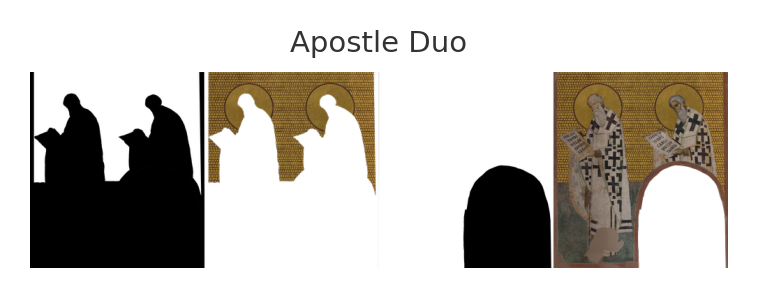
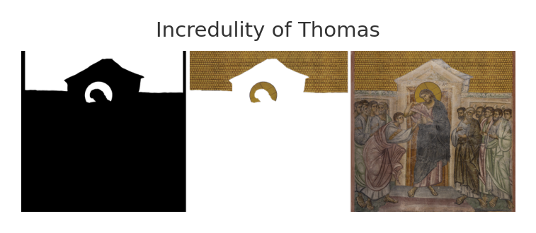
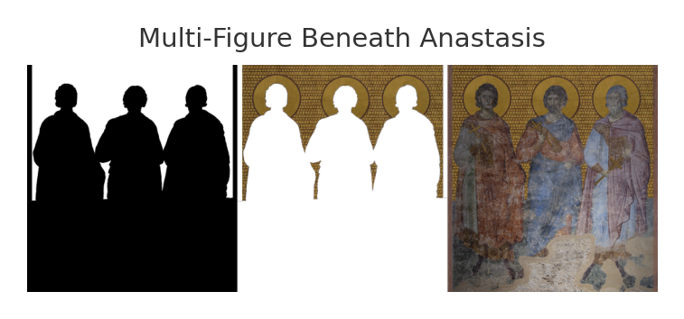
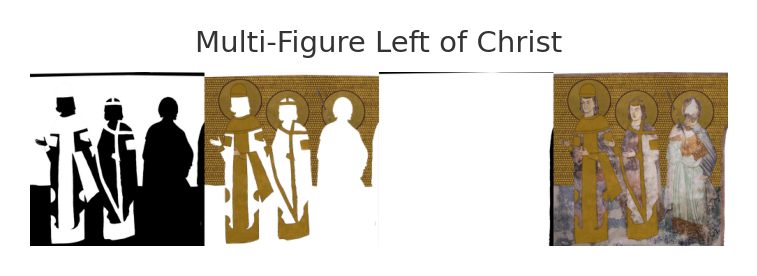
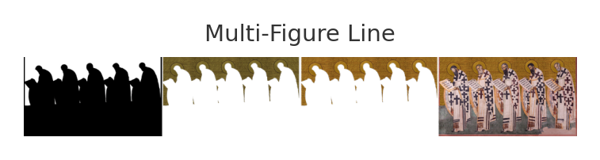
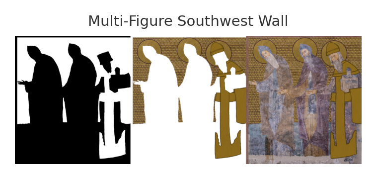
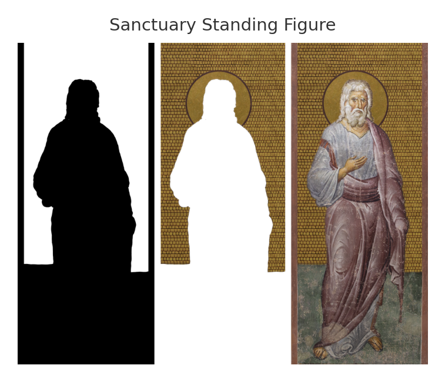
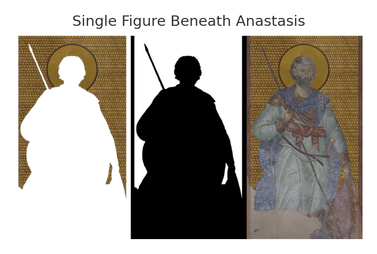
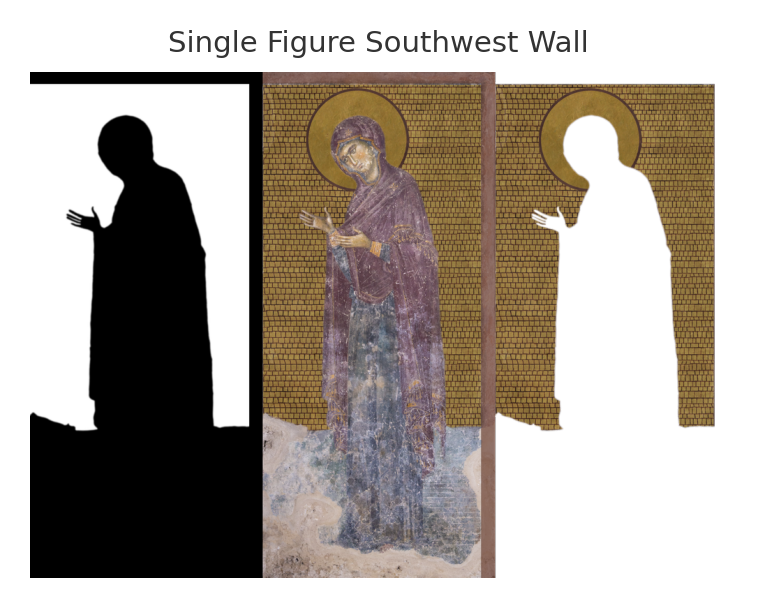

## Summary

This project digitally reconstructs the interior of the medieval Serbian Sopoćani Monastery using modern 3D modeling, shading, and compositing techniques. Starting from a raw 3D scan, a custom pipeline was designed using Adobe Creative Cloud to rebuild damaged architectural elements, refined and applied historically accurate textures, and recreated lost gilded mosaics. The enhanced model was then animated and lit in Autodesk Maya to produce a final rendered video that reimagines the space with visual fidelity grounded in both technical precision and historical research.

## Motivation

This project explores how digital reconstruction can serve both historical scholarship and public engagement by restoring elements of cultural heritage no longer fully visible on-site. Many of the Sopoćani Monastery's original interior features—especially the gilded mosai backgrounds—have deteriorated over time. By combining field documentation with digital tools, the project aimed to visualize these lost elements with greater accuracy. The reconstruction contributes to ongoing art historiy research while also demonstrating the potential of 3D modeling and rendering in related fields.

## Achievements

1. Developed a custom texturing workflow in Adobe Creative Cloud to recreate historically-informed gilding, with special attention to the haloes and gilded wall motifs.
2. Integrated high-res photographic textures into Maya model.
3. Animated camera movements and optimized lighting within Maya.

## Next Steps

- [ ] Explore interactive or VR-based presentations for educational use.

## Method

### Image Preparation and Texture Reconstruction

High-resolution images of the church in its modern state were used as a foundation for the texturing process. In Adobe Photoshop, perspective distortion was corrected using the `Perspective Warp` tool, and detailed selection masks were created for individual portrait figures. Layer masks and compositing techniques were employed to replace deteriorated facial features and clothing with photorealistic mosaic textures, prioritizing seamless continuity between adjacent portraits in their original 3D layout.

Gold halos were digitally added to figures known to have had them historically, ensuring historical fidelity. Where figures or surfaces were lost or degraded, reconstructions drew on surviving references and academic sources to inform texture design. Alpha masks were exported for use in PBR materials and integrated into Autodesk Maya, where the textures were mapped onto the refined 3D geometry.

### Camera Animation and Lighting

Camera paths were also animated in Maya to guide viewer focus through the reconstructed space. Lighting was optimized to emphasize surface detail and spatial depth, contributing to a coherent and immersive final render.
