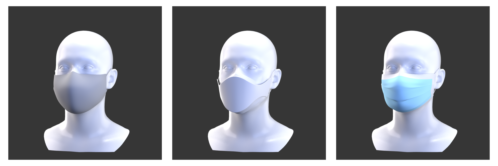

## Summary

This research project explores procedural methods for generating a scalable and photorealistic database of synthetic human faces, with the goal of supporting computer vision tasks that depend on high-quality training data. The work targets the persistent domain gap between real and synthetic faces by focusing on diversity, realism, and how they can be achieved through automation.

A custom pipeline was developed to apply personalized hairstyles using Autodesk Maya’s XGen Python API, deform glasses using Houdini’s `hython` interface, and manipulate headwear and facial accessories using Maya’s native Python API, `mayapy`, and deformation tools such as Proximity Wrap and Delta Mush. The input to this pipeline consists of morphable human face meshes from the in-house dataset generated via the [ICT Vision and Graphics Lab's FaceKit](https://github.com/USC-ICT/ICT-FaceKit), captured using the lab’s Light Stage 6 photogrammetry system. Additionally, all outputs are textured using custom albedo, specular-unlit, displacement, and tangent-space normal maps derived from the lab’s [Facial Reflectance Field](https://vgl.ict.usc.edu/Software/FaceDemo/) research.

The result is a Python algorithm that can produce high-fidelity, fully renderable digital human assets with minimal manual intervention. These assets serve as a foundation for future applications in avatar creation, facial parsing, and synthetic data-driven learning frameworks.

## Motivation

Photorealistic synthetic human data has become an increasingly valuable asset in computer vision, enabling robust training of models for tasks such as facial landmark detection, expression recognition, and semantic parsing. However, a critical challenge persists: the domain gap between synthetic and real-world facial data often limits the effectiveness of synthetic assets in production-level systems. While the visual effects and gaming industries have demonstrated that high-fidelity digital humans are possible, these models are typically produced through time-intensive, artisanal workflows that do not scale for research or dataset generation.

This project seeks to address that gap by developing a scalable and automated pipeline that can generate diverse, high-quality digital human models with minimal manual intervention. In particular, the work focuses on representing real-world complexity — such as variation in hair, accessories, and facial geometry — in a way that is both procedurally controlled and render-ready. By grounding this work in established studio-grade asset pipelines and adapting them for algorithmic execution, the project contributes toward making high-resolution synthetic faces more accessible to data-driven research in computer vision and machine learning.

## Achievements

1. Developed a rigging-based deformation system for rigid eyewear using Houdini’s `hython` interface. This approach utilizes face-specific anchor points and inverse kinematics to ensure proper alignment and collision-free positioning.
2. Automated hairstyle customization through scripted control of Autodesk Maya’s XGen modifiers. The system adjusts properties such as length, color, curl, and density to introduce realistic variation across generated individuals.
3. Implemented geometry fitting of soft and semi-rigid headwear using Maya’s `mayapy` scripting interface and deformation tools such as Proximity Wrap, allowing garments to adapt dynamically to changes in face shape and orientation.
4. Applied Delta Mush deformation to fit items like facewear and jewelry while preserving surface detail and minimizing distortion. The process ensures accessories conform smoothly to localized facial geometry.

## Next Steps

- [ ] Incorporate conditional hairstyle generation based on a target mesh’s sex and inferred ethnic background to improve representational accuracy and dataset diversity.
- [ ] Fix shader issues for mesh eyelashes.
- [ ] Fix missing textures for assets.
- [ ] Explore more efficient, expanded, and purposeful usage of Houdini within pipeline.

## Method

### Rigid Facial Accessories


Rigid facial accessories such as glasses are automatically deformed and aligned to subject-specific geometry using a Houdini-based rigging pipeline. The key idea is to extract 3D facial landmarks from the [FaceKit](https://github.com/USC-ICT/ICT-FaceKit) meshes — specifically, predefined indices corresponding to anatomical regions like the nasal bridge and ear positions — and use them as anchor points for rig alignment.

To achieve a reliable fit across identities, a joint-based rig structure is initialized and driven by inverse kinematics (IK) principles. After establishing anchor point positions on the facial mesh (e.g., right/left nasal, right/left ear), the system computes the original and target angles of the glasses' temple arms. These angles are measured by projecting joint chains into the sagittal plane and calculating their deviation using the arctangent of the vertical-to-depth component ratio:

```python
# deform_houdini/deform_glasses.py
r_orig_dist = joint_outer - joint_tip r_orig_angle = 90 - arctangent(r_orig_dist.z / r_orig_dist.y)
r_new_dist = joint_outer - ear_anchor r_new_angle = 90 - arctangent(r_new_dist.z / r_new_dist.y)
r_theta = r_new_angle - r_orig_angle
```

These angle offsets (`r_theta`, `l_theta`) are applied to the hinge joints to ensure the temple arms rotate cleanly into their final position, preserving the structural rigidity of the asset. This effectively solves a planar IK problem using trigonometric inference based on two known positions per limb and a shared base joint.


#### Pipeline Contribution

To ensure consistency across meshes, I created internal documentation — spreadsheets — to standardize naming conventions and unique asset geometry-prefixing within the project pipeline. This supported the Maya-to-Houdini import process and was shared with the lab’s 3D modeling artist and my supervisor, allowing them to run or adapt the system without needing in-depth knowledge of CG tooling or the DCCs’ APIs.

### Hair Customization Using XGen API

To generate diverse hairstyles across subjects, I implemented a procedural customization system using Autodesk Maya’s XGen Python API. The pipeline modifies visual and structural parameters of XGen descriptions programmatically, enabling randomized variation in length, color, clumping, curl, and noise.

Each XGen collection is imported and assigned an `aiStandardHair` shader. All adjustments are handled through direct calls to `xgenm.xg` methods, which interface with XGen modifiers at the attribute level. Collections are referenced by name and modified using setter methods such as `xg.setAttr()`, which applies changes to specific descriptions within the groom. Modifiers are adjusted by reading the previous value via helper functions and applying bounded random offsets. If a given modifier (e.g., noise or coil) doesn’t already exist, the system adds a new FX module programmatically and initializes it with appropriate parameters.

For example, the following function modifies the coil deformation applied to hair strands, adjusting both count and radius ramp:

```python
# scripts/hair_modify_xgen/hair_modify.py
def set_coil(col, desc, mod, count, radius):
    new_cc = max(0, prev.get_prev(col, desc, mod, "count") + count)
    xg.setAttr("count", f"$cLength > 1.25 ? {str(new_cc)} : 0", col, desc, mod)

    prev_ccr, prev_cct = prev.get_prev_ramp(col, desc, mod, "radiusScale")
    new_ccr = min(1, max(0, prev_ccr + radius[0]))
    new_cct = min(1, max(0, prev_cct + radius[1]))
    xg.setAttr(
        "radiusScale", f"rampUI(0.0,{new_ccr},3:1.0,{new_cct},3)", col, desc, mod
    )
```

Hair color is selected from a predefined dictionary of natural shades and applied directly to the assigned `aiStandardHair` shader’s `baseColor` attribute. The process is randomized per subject while retaining structural consistency by building on a set of shared base grooms.

This setup allows fully batched, stylized hair generation at scale without relying on manual groom editing or artist intervention.


## Headwear Assets Deformation


Headwear accessories are conformed to target meshes using a proximity-driven deformation workflow in Maya. The deformation is unique to each asset — guided by procedurally generated point weights, where each vertex's influence is determined by its distance from the face mesh. This weighting strategy ensures that regions of the asset closer to the face are more deformable, while distant regions remain more rigid.


### Fitted Facial Accessories Deformation



Facial accessories are fitted to target meshes using a localized deformation strategy. Unlike rigid or headwear assets, these items require a higher degree of surface adherence to fit high curvature or articulation areas like the nose, cheeks, and jaw.


To support this, deformation weights are first computed procedurally based on vertex proximity to the underlying facial geometry, similar to the headwear assets. However, additionally a smoothing stage is then applied to mitigate shearing and surface noise introduced during proximity wrapping. The method preserves fine detail from the original geometry while producing a smooth transition across regions with sharp spatial gradients.


### Platform Integration Strategy

Lastly, an early challenge involved determining which digital content creation tools to use, given the differing strengths and limitations of Maya and Houdini. Maya offered native control over hair grooming and direct mesh manipulation via the XGen and deformation APIs, while Houdini provided a flexible procedural system and novel VEX-based workflows, ideal for simulation of rig-based accessories like glasses. Rather than rely on one tool exclusively, the pipeline was split to leverage either Maya or Houdini where it was most effective. This approach offered the opportunity to explore connector strategies between Maya and Houdini — an arguably less developed area in CG pipelines.
